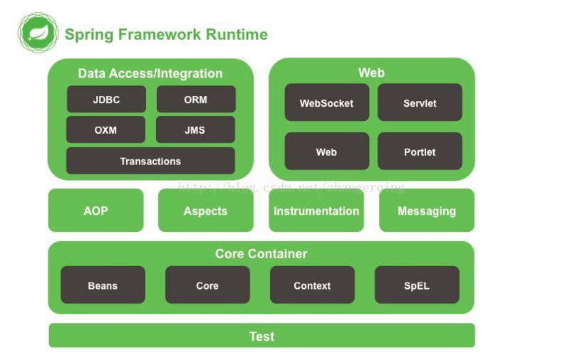
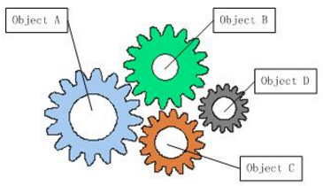
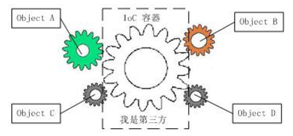
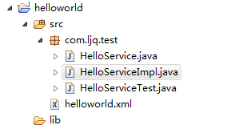
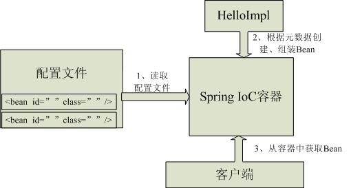

# 一看就懂的Java Spring分析详解

@(Spring)


## Spring是什么？

Spring是基于**Java**的**轻量级**的**J2EE应用层**框架。

 1. 基于java不解释
 2. 轻量级：速度比较快内存消耗比较低
 3. J2EE是一个体系，J2EE应用主要分为三层，表现层，业务层，数据层
            sping敢说自己是一个应用层框架，
                比如是struts就定位是 MVC框架web层的专门做表现层的。hibernate 定位是一个ORM mapping框架，专门做数据层的。  
              也就是说spring非常强大能够服务于J2EE框架开发过程中的各个层面，才敢说这么大的话。
              这三层表现在什么地方呢；
              1.表现层 SpringMvc
              2.逻辑层 Bean管理，AOP，事务管理
              3.数据层 SpringJDBCTemplate  


## Spring核心技术  ##

两大核心技术：

 1. IOC(Inversion of Control):控制反转
 2. AOP(Aspect Oriented Programming)：面向切面编程/面向方便编程

      



解读此图得出结论：
Spring 就相当于一个超级“粘合剂” 此处引用京东老总说的一段话... 刘邦  ，将很多技术粘合在一起，形成一个整体，使每个组件发挥其最大功效。相当于航空母舰。


## IOC(Inversion of Control)  ##

带着三个问题去学习？

 1. 谁控制谁？控制的双方是什么？
 2. 什么是反转？反转什么？怎么反转？
 3. 为什么是反转？反转的好处是什么？正向有什么害处？


### Spring的出现都干了什么？

Spring的出现改变了以应用程序为中心的局面，变为Spring为中心，由Spring 控制所有的程序运行过程中所需要的资源，当应用程序需要使用资源时。找Spring 要而不是自己创建。Spring握有应用程序运行中的**全部资源**

    IOC:Spring 反向控制应用程序需要使用的外部资源。
    
    
###  IOC 的优势？

所有的资源由Spring统一调度，统一管理，使对象中的控制更加集中，避免应用程序中出现多余的对象，浪费资源。降低组件之间的耦合性，让我们更专注于应用逻辑.可以把IoC模式看做是工厂模式的升华.


在软件开发过程中，**系统的各对象之间，各模块之间，软件系统与硬件系统之间或多或少都会存在耦合关系**，如果一个系统的耦合度过高，就会造成难以维护的问题。下图展示了系统中的耦合问题




为了解决上面介绍的耦合度过高的问题，IOC理论提出了借助“第三方”来实现具有依赖关系的对象之间的解耦。如下图所示





这样各个对象之间就不直接关联，而是在需要用到对方的时候由IOC容器（第三方）来管理对象之间的依赖关系，我们只需要维护相对独立的各个对象代码即可。


### 实例


1. 创建标准Java工程





2.开发接口，此处我们只需实现打印“Hello World!”，所以我们定义一个“sayHello”接口，代码如下:

```
package com.ljq.test;
 
public interface HelloService {
    public void sayHello();  
}
```

 3.接口开发好了，让我们来通过实现接口来完成打印“Hello World!”功能:

```
package com.ljq.test;
 
public class HelloServiceImpl implements HelloService{
    public void sayHello(){
        System.out.println("Hello World!");
    }
}
```

4.接口和实现都开发好了，那如何使用Spring IOC容器来管理它们呢？这就需要配置文件，让IOC容器知道要管理哪些对象。让我们来看下配置文件helloworld.xml（放到src目录下）：


```
<?xml version="1.0" encoding="UTF-8"?>
<beans xmlns="http://www.springframework.org/schema/beans"
    xmlns:xsi="http://www.w3.org/2001/XMLSchema-instance"
    xmlns:context="http://www.springframework.org/schema/context"
    xsi:schemaLocation="
        http://www.springframework.org/schema/beans        
        http://www.springframework.org/schema/beans/spring-beans-3.0.xsd
        http://www.springframework.org/schema/context                
        http://www.springframework.org/schema/context/spring-context-3.0.xsd">
    <!-- spring管理的资源统称为Bean -->
    <!-- bean:id:为bean指定一个名称 -->
	<!-- bean:class:表示bean的类型 -->
 
    <bean id="helloService" class="com.ljq.test.HelloServiceImpl" />
    
</beans>
```

5.现在万一具备，那如何获取IOC容器并完成我们需要的功能呢？**首先应该实例化一个IOC容器，然后从容器中获取需要的对象**，然后调用接口完成我们需要的功能，代码示例如下：


```
package com.ljq.test;

import org.junit.Test;
import org.springframework.context.ApplicationContext;
import org.springframework.context.support.ClassPathXmlApplicationContext;

/**
 * 测试
 * 
 * @author 石志远
 * @version 1.0 2017-11-5 下午10:56:04
 */
public class HelloServiceTest {
    @Test
    public void testHelloWorld() {
        // 1、读取配置文件实例化一个IOC容器
        ApplicationContext context = new ClassPathXmlApplicationContext("helloworld.xml");
        // 2、从容器中获取Bean，注意此处完全“面向接口编程，而不是面向实现”
        HelloService helloService = context.getBean("helloService", HelloService.class);
        // 3、执行业务逻辑
        helloService.sayHello();
        
        /*
		ApplicationContext ctx = new FileSystemXmlApplicationContext("applicationContext.xml");
		HelloService helloService = context.getBean("helloService", HelloService.class);
        helloService.sayHello();
		*/
    }
}
```


### 详解IOC容器
在Spring IOC容器的代表就是`org.springframework.beans`包中的`BeanFactory接口`，BeanFactory接口提供了IOC容器最基本功能；
而`org.springframework.context`包下的`ApplicationContext接口扩展了BeanFactory`，还提供了与Spring AOP集成、国际化处理、事件传播及提供不同层次的context实现 (如针对web应用的WebApplicationContext)。

简单说， `BeanFactory`提供了IOC容器最基本功能，而 `ApplicationContext` 则增加了更多支持企业级功能支持。**ApplicationContext完全继承BeanFactory，因而BeanFactory所具有的语义也适用于ApplicationContext。****Bean之间几乎没有依赖关系**


### 容器实现一览
 - `XmlBeanFactory：`  **BeanFactory实现，提供基本的IOC容器功能，可以从classpath或文件系统等获取资源**

```
1.  File file = new File("fileSystemConfig.xml");
    Resource resource = new FileSystemResource(file);
    BeanFactory beanFactory = new XmlBeanFactory(resource);

-------------------------------------------------------------

 - Resource resource = new ClassPathResource("classpath.xml"); 
   BeanFactory beanFactory = new XmlBeanFactory(resource);
```
 - `ClassPathXmlApplicationContext`：**ApplicationContext实现，从classpath获取配置文件**

```
BeanFactory beanFactory = new ClassPathXmlApplicationContext("classpath.xml");
```

 - `FileSystemXmlApplicationContext`：**ApplicationContext实现，从文件系统获取配置文件**

```
BeanFactory beanFactory = new FileSystemXmlApplicationContext("fileSystemConfig.xml");
```

### ApplicationContext接口获取Bean方法：

 1. Object getBean(String name)

        根据名称返回一个Bean，客户端需要自己进行类型转换；

 2. T getBean(String name, Class<T> requiredType)
        根据名称和指定的类型返回一个Bean，客户端无需自己进行类型转换，如果类型转换失败，容器抛出异常；

 3. T getBean(Class<T> requiredType)

        根据指定的类型返回一个Bean，客户端无需自己进行类型转换，如果没有或有多于一个Bean存在容器将抛出异常；

 4. Map<String, T> getBeansOfType(Class<T> type)

        根据指定的类型返回一个键值为名字和值为Bean对象的Map，如果没有Bean对象存在则返回空的Map。





### BeanFactory与ApplicationContext


传智播客有一个老师讲的不错.链接：http://pan.baidu.com/s/1bpk5zMB 密码：j6u9

1.BeanFactroy采用的是延迟加载形式来注入Bean的，即只有在使用到某个Bean时(调用getBean())，才对该Bean进行加载实例化，这样，我们就不能发现一些存在的Spring的配置问题。而ApplicationContext则相反，它是在容器启动时，一次性创建了所有的Bean。这样，在容器启动时，我们就可以发现Spring中存在的配置错误。 相对于基本的BeanFactory，ApplicationContext 唯一的不足是占用内存空间。当应用程序配置Bean较多时，程序启动较慢。

BeanFacotry延迟加载,如果Bean的某一个属性没有注入，BeanFacotry加载后，直至第一次使用调用getBean方法才会抛出异常；而ApplicationContext则在初始化自身是检验，这样有利于检查所依赖属性是否注入；所以通常情况下我们选择使用 ApplicationContext。
应用上下文则会在上下文启动后预载入所有的单实例Bean。通过预载入单实例bean ,确保当你需要的时候，你就不用等待，因为它们已经创建好了。

2.BeanFactory和ApplicationContext都支持BeanPostProcessor、BeanFactoryPostProcessor的使用，但两者之间的区别是：BeanFactory需要手动注册，而ApplicationContext则是自动注册。（Applicationcontext比 beanFactory 加入了一些更好使用的功能。而且 beanFactory 的许多功能需要通过编程实现而 Applicationcontext 可以通过配置实现。比如后处理 bean ， Applicationcontext 直接配置在配置文件即可而 beanFactory 这要在代码中显示的写出来才可以被容器识别。 ）

3.beanFactory主要是面对与 spring 框架的基础设施，面对 spring 自己。而 Applicationcontex 主要面对与 spring 使用的开发者。基本都会使用 Applicationcontex 并非 beanFactory 。


### 为何是反转，哪些方面反转了

有反转就有正转，传统应用程序是由我们自己在对象中主动控制去直接获取依赖对象，也就是正转；而反转则是由容器来帮忙创建及注入依赖对象；为何是反转？**因为由容器帮我们查找及注入依赖对象，对象只是被动的接受依赖对象，所以是反转；哪些方面反转了？依赖对象的获取被反转了**。


### DI
即依赖注入（Dependency Injection），在IOC容器运行期间，动态的将某种依赖关系注入到对象之中.

DI—Dependency Injection，即“依赖注入”：组件之间依赖关系由容器在运行期决定，形象的说，**即由容器动态的将某个依赖关系注入到组件之中。**
**依赖注入的目的并非为软件系统带来更多功能，而是为了提升组件重用的频率**，并为系统搭建一个灵活、可扩展的平台。通过依赖注入机制，我们只需要通过简单的配置，而无需任何代码就可指定目标需要的资源，完成自身的业务逻辑，而不需要关心具体的资源来自何处，由谁实现。

理解DI的关键是：“**谁依赖谁，为什么需要依赖，谁注入谁，注入了什么**”，那我们来深入分析一下

    


 - **谁依赖于谁**：当然是应用程序依赖于IoC容器；

 - **为什么需要依赖**：应用程序需要IoC容器来提供对象需要的外部资源；

 - **谁注入谁**：很明显是IoC容器注入应用程序某个对象，应用程序依赖的对象；

 - **注入了什么**：就是注入某个对象所需要的外部资源（包括对象、资源、常量数据）


### IoC和DI由什么关系呢？

其实它们是**同一个概念的不同角度描述**，由于控制反转概念比较含糊（可能只是理解为容器控制对象这一个层面，很难让人想到谁来维护对象关系），所以2004年大师级人物**Martin Fowler**又给出了一个新的名字：“依赖注入”，相对IoC 而言，“**依赖注入”明确描述了“被注入对象依赖IoC容器配置依赖对象**”。


***
OVER


     
     
     