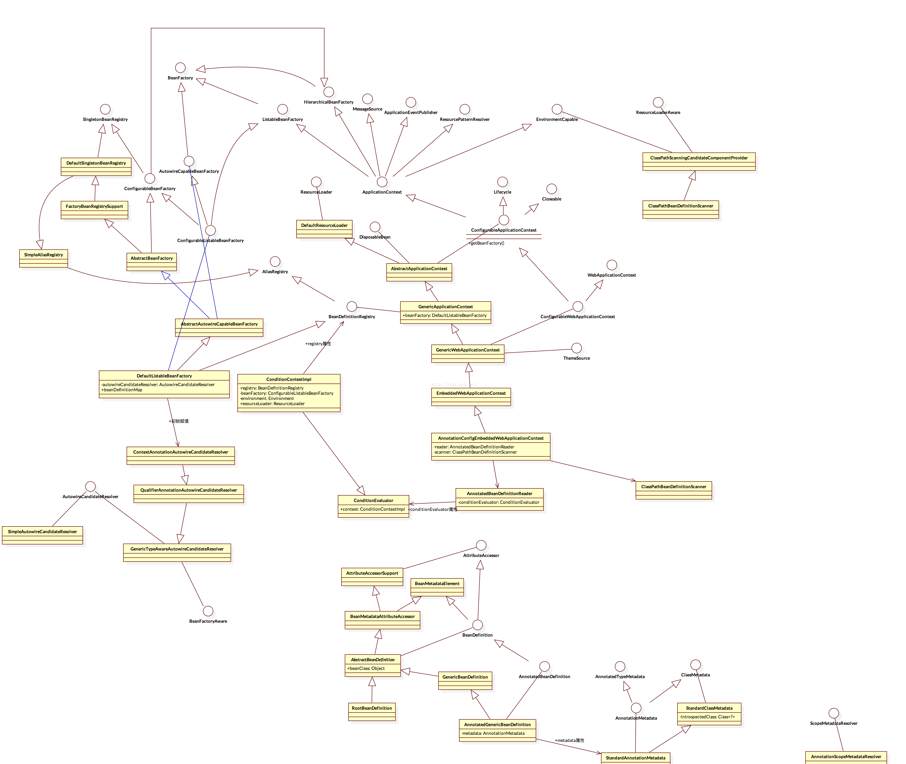

# Spring Boot上下文的创建

***
[toc]
***


@(SpringBoot)

*** 

## ApplicationContext

在run方法中执行:

```java
context  = createApplicationContext();  
```


创建上下文:

```java
protected ConfigurableApplicationContext createApplicationContext() {  
        Class<?> contextClass = this.applicationContextClass;  
        if (contextClass == null) {  
            try {  
                contextClass = Class  
                        .forName(this.webEnvironment ? DEFAULT_WEB_CONTEXT_CLASS  
                                : DEFAULT_CONTEXT_CLASS);  
            }  
            catch (ClassNotFoundException ex) {  
                throw new IllegalStateException(  
                        "Unable create a default ApplicationContext, "  
                                + "please specify an ApplicationContextClass", ex);  
            }  
        }  
        return (ConfigurableApplicationContext) BeanUtils.instantiate(contextClass);  
    }  
```


创建`DEFAULT_WEB_CONTEXT_CLASS` -->`AnnotationConfigEmbeddedWebApplicationContext`实例，创建实例
 调用构造方法，首先需要分清楚spring boot中多上下文之间的关联关系，




结构相对比较复杂一些:

执行`AnnotationConfigEmbeddedWebApplicationContext`构造方法:

```java
public AnnotationConfigEmbeddedWebApplicationContext() {  
        this.reader = new AnnotatedBeanDefinitionReader(this);  
        this.scanner = new ClassPathBeanDefinitionScanner(this);  
    }  
```

**实例化`AnnotatedBeanDefinitionReader`以及`ClassPathBeanDefinitionScanner`**:


- 实例化`AnnotatedBeanDefinitionReader`

```java
public AnnotatedBeanDefinitionReader(BeanDefinitionRegistry registry) {  
        this(registry, getOrCreateEnvironment(registry));  
    }  
```


调用:
```java
public AnnotatedBeanDefinitionReader(BeanDefinitionRegistry registry, Environment environment) {  
        Assert.notNull(registry, "BeanDefinitionRegistry must not be null");  
        Assert.notNull(environment, "Environment must not be null");  
        this.registry = registry;  
        this.conditionEvaluator = new ConditionEvaluator(registry, environment, null);  
        AnnotationConfigUtils.registerAnnotationConfigProcessors(this.registry);  
    }  
```

实例化 `ConditionEvaluator`，将其属性`ConditionContextImpl`赋值

```java
AnnotationConfigUtils.registerAnnotationConfigProcessors(this.registry);  
```


实现如下：


```java
public static Set<BeanDefinitionHolder> registerAnnotationConfigProcessors(  
            BeanDefinitionRegistry registry, Object source) {  
  
        DefaultListableBeanFactory beanFactory = unwrapDefaultListableBeanFactory(registry);  
        if (beanFactory != null) {  
            if (!(beanFactory.getDependencyComparator() instanceof AnnotationAwareOrderComparator)) {  
                beanFactory.setDependencyComparator(AnnotationAwareOrderComparator.INSTANCE);  
            }  
            if (!(beanFactory.getAutowireCandidateResolver() instanceof ContextAnnotationAutowireCandidateResolver)) {  
                beanFactory.setAutowireCandidateResolver(new ContextAnnotationAutowireCandidateResolver());  
            }  
        }  
  
        Set<BeanDefinitionHolder> beanDefs = new LinkedHashSet<BeanDefinitionHolder>(4);  
  
        if (!registry.containsBeanDefinition(CONFIGURATION_ANNOTATION_PROCESSOR_BEAN_NAME)) {  
            RootBeanDefinition def = new RootBeanDefinition(ConfigurationClassPostProcessor.class);  
            def.setSource(source);  
            beanDefs.add(registerPostProcessor(registry, def, CONFIGURATION_ANNOTATION_PROCESSOR_BEAN_NAME));  
        }  
  
        if (!registry.containsBeanDefinition(AUTOWIRED_ANNOTATION_PROCESSOR_BEAN_NAME)) {  
            RootBeanDefinition def = new RootBeanDefinition(AutowiredAnnotationBeanPostProcessor.class);  
            def.setSource(source);  
            beanDefs.add(registerPostProcessor(registry, def, AUTOWIRED_ANNOTATION_PROCESSOR_BEAN_NAME));  
        }  
  
        if (!registry.containsBeanDefinition(REQUIRED_ANNOTATION_PROCESSOR_BEAN_NAME)) {  
            RootBeanDefinition def = new RootBeanDefinition(RequiredAnnotationBeanPostProcessor.class);  
            def.setSource(source);  
            beanDefs.add(registerPostProcessor(registry, def, REQUIRED_ANNOTATION_PROCESSOR_BEAN_NAME));  
        }  
  
        // Check for JSR-250 support, and if present add the CommonAnnotationBeanPostProcessor.  
        if (jsr250Present && !registry.containsBeanDefinition(COMMON_ANNOTATION_PROCESSOR_BEAN_NAME)) {  
            RootBeanDefinition def = new RootBeanDefinition(CommonAnnotationBeanPostProcessor.class);  
            def.setSource(source);  
            beanDefs.add(registerPostProcessor(registry, def, COMMON_ANNOTATION_PROCESSOR_BEAN_NAME));  
        }  
  
        // Check for JPA support, and if present add the PersistenceAnnotationBeanPostProcessor.  
        if (jpaPresent && !registry.containsBeanDefinition(PERSISTENCE_ANNOTATION_PROCESSOR_BEAN_NAME)) {  
            RootBeanDefinition def = new RootBeanDefinition();  
            try {  
                def.setBeanClass(ClassUtils.forName(PERSISTENCE_ANNOTATION_PROCESSOR_CLASS_NAME,  
                        AnnotationConfigUtils.class.getClassLoader()));  
            }  
            catch (ClassNotFoundException ex) {  
                throw new IllegalStateException(  
                        "Cannot load optional framework class: " + PERSISTENCE_ANNOTATION_PROCESSOR_CLASS_NAME, ex);  
            }  
            def.setSource(source);  
            beanDefs.add(registerPostProcessor(registry, def, PERSISTENCE_ANNOTATION_PROCESSOR_BEAN_NAME));  
        }  
  
        return beanDefs;  
    }  
```


```
DefaultListableBeanFactory beanFactory = unwrapDefaultListableBeanFactory(registry); 
```


### 获取`beanFactory`信息


```java
private static DefaultListableBeanFactory unwrapDefaultListableBeanFactory(BeanDefinitionRegistry registry) {  
        if (registry instanceof DefaultListableBeanFactory) {  
            return (DefaultListableBeanFactory) registry;  
        }  
        else if (registry instanceof GenericApplicationContext) {  
            return ((GenericApplicationContext) registry).getDefaultListableBeanFactory();  
        }  
        else {  
            return null;  
        }  
    }  

```
代码执行到`registry instanceof GenericApplicationContext(通过类继承结构可得到)`，随后调用`GenericApplicationContext#getDefaultListableBeanFactory()`方法，`GenericApplicationContext`在构造方法中实例化了属性`beanFactory`的值为`DefaultListableBeanFactory`:


```java
public GenericApplicationContext() {  
        this.beanFactory = new DefaultListableBeanFactory();  
    } 
```

其构造优先于`AnnotationConfigEmbeddedWebApplicationContext`构造方法执行。

以上获得了`BeanFactory`信息:


### BeanDefinition

在获取完`BeanFactory`以后，代码中涉及到了bean定义信息，首先来看下`BeanDefinition`相关信息


- `BeanDefinition` 设计bean相关信息
- `BeanDefinitionHolder` 封装bean定义相关信息，以及bean名称、别名等
- `BeanDefinitionRegistry` 持有所有注册的bean相关信息


```java
if (!registry.containsBeanDefinition(CONFIGURATION_ANNOTATION_PROCESSOR_BEAN_NAME)) {  
            RootBeanDefinition def = new RootBeanDefinition(ConfigurationClassPostProcessor.class);  
            def.setSource(source);  
            beanDefs.add(registerPostProcessor(registry, def, CONFIGURATION_ANNOTATION_PROCESSOR_BEAN_NAME));  
        }  
```
这段代码以及其紧跟的代码为创建若干bean，其中`registerPostProcessor(registry, def, CONFIGURATION_ANNOTATION_PROCESSOR_BEAN_NAME) `表示注册名称为`org.springframework.context.annotation.internalConfigurationAnnotationProcessor`，beanClass 对应为`ConfigurationClassPostProcessor`的bean


### Bean注册


```java
private static BeanDefinitionHolder registerPostProcessor(  
            BeanDefinitionRegistry registry, RootBeanDefinition definition, String beanName) {  
  
        definition.setRole(BeanDefinition.ROLE_INFRASTRUCTURE);  
        registry.registerBeanDefinition(beanName, definition);  
        return new BeanDefinitionHolder(definition, beanName);  
    }  
```
其中`registry.registerBeanDefinition(beanName,definition)`调用**`GenericApplicationContext`**中的方法


```java
public void registerBeanDefinition(String beanName, BeanDefinition beanDefinition)  
            throws BeanDefinitionStoreException {  
  
        this.beanFactory.registerBeanDefinition(beanName, beanDefinition);  
    }  
```

其中`this.beanFactory`为**`DefaultListableBeanFactory`**实例

```java
public void registerBeanDefinition(String beanName, BeanDefinition beanDefinition)  
            throws BeanDefinitionStoreException {  
  
        Assert.hasText(beanName, "Bean name must not be empty");  
        Assert.notNull(beanDefinition, "BeanDefinition must not be null");  
  
        if (beanDefinition instanceof AbstractBeanDefinition) {  
            try {  
                ((AbstractBeanDefinition) beanDefinition).validate();  
            }  
            catch (BeanDefinitionValidationException ex) {  
                throw new BeanDefinitionStoreException(beanDefinition.getResourceDescription(), beanName,  
                        "Validation of bean definition failed", ex);  
            }  
        }  
  
        BeanDefinition oldBeanDefinition;  
  
        oldBeanDefinition = this.beanDefinitionMap.get(beanName);  
        if (oldBeanDefinition != null) {  
            if (!isAllowBeanDefinitionOverriding()) {  
                throw new BeanDefinitionStoreException(beanDefinition.getResourceDescription(), beanName,  
                        "Cannot register bean definition [" + beanDefinition + "] for bean '" + beanName +  
                        "': There is already [" + oldBeanDefinition + "] bound.");  
            }  
            else if (oldBeanDefinition.getRole() < beanDefinition.getRole()) {  
                // e.g. was ROLE_APPLICATION, now overriding with ROLE_SUPPORT or ROLE_INFRASTRUCTURE  
                if (this.logger.isWarnEnabled()) {  
                    this.logger.warn("Overriding user-defined bean definition for bean '" + beanName +  
                            "' with a framework-generated bean definition: replacing [" +  
                            oldBeanDefinition + "] with [" + beanDefinition + "]");  
                }  
            }  
            else {  
                if (this.logger.isInfoEnabled()) {  
                    this.logger.info("Overriding bean definition for bean '" + beanName +  
                            "': replacing [" + oldBeanDefinition + "] with [" + beanDefinition + "]");  
                }  
            }  
        }  
        else {  
            this.beanDefinitionNames.add(beanName);  
            this.manualSingletonNames.remove(beanName);  
            this.frozenBeanDefinitionNames = null;  
        }  
        this.beanDefinitionMap.put(beanName, beanDefinition);  
  
        if (oldBeanDefinition != null || containsSingleton(beanName)) {  
            resetBeanDefinition(beanName);  
        }  
    }  
```


以上方法完成了bean的注册；

首先完成校验:

```java
((AbstractBeanDefinition) beanDefinition).validate();  
```


```java
oldBeanDefinition = this.beanDefinitionMap.get(beanName);  
```
表示从map中获取bean，初始肯定无法获取，进入如下程序:

```java
	this.beanDefinitionNames.add(beanName);   
	this.manualSingletonNames.remove(beanName);  
	this.frozenBeanDefinitionNames = null;           
	this.beanDefinitionMap.put(beanName, beanDefinition);  
```

**完成bean信息的存储。**

这里顺便解释下，**在从map中获取到bean时表示bean已经注册，则会判断是否可以覆盖oldBean，也需要判断bean对应的Role级别**

 以上完成了`AnnotatedBeanDefinitionReader`实例的构造;;


### ClassPathBeanDefinitionScanner

接下来为`ClassPathBeanDefinitionScanner`实例的创建

```java
public ClassPathBeanDefinitionScanner(BeanDefinitionRegistry registry, boolean useDefaultFilters) {  
        this(registry, useDefaultFilters, getOrCreateEnvironment(registry));  
    }  
```
调用

```java
public ClassPathBeanDefinitionScanner(BeanDefinitionRegistry registry, boolean useDefaultFilters, Environment environment) {  
        super(useDefaultFilters, environment);  
  
        Assert.notNull(registry, "BeanDefinitionRegistry must not be null");  
        this.registry = registry;  
  
        // Determine ResourceLoader to use.  
        if (this.registry instanceof ResourceLoader) {  
            setResourceLoader((ResourceLoader) this.registry);  
        }  
    }  
```

调用super构造:
```java
public ClassPathScanningCandidateComponentProvider(boolean useDefaultFilters, Environment environment) {  
        if (useDefaultFilters) {  
            registerDefaultFilters();  
        }  
        Assert.notNull(environment, "Environment must not be null");  
        this.environment = environment;  
    }  
```

在该方法中完成了`environment`的赋值以及为`ClassPathScanningCandidateComponentProvider`完成了默认过滤器的注册:

```java
protected void registerDefaultFilters() {  
        this.includeFilters.add(new AnnotationTypeFilter(Component.class));  
        ClassLoader cl = ClassPathScanningCandidateComponentProvider.class.getClassLoader();  
        try {  
            this.includeFilters.add(new AnnotationTypeFilter(  
                    ((Class<? extends Annotation>) ClassUtils.forName("javax.annotation.ManagedBean", cl)), false));  
            logger.debug("JSR-250 'javax.annotation.ManagedBean' found and supported for component scanning");  
        }  
        catch (ClassNotFoundException ex) {  
            // JSR-250 1.1 API (as included in Java EE 6) not available - simply skip.  
        }  
        try {  
            this.includeFilters.add(new AnnotationTypeFilter(  
                    ((Class<? extends Annotation>) ClassUtils.forName("javax.inject.Named", cl)), false));  
            logger.debug("JSR-330 'javax.inject.Named' annotation found and supported for component scanning");  
        }  
        catch (ClassNotFoundException ex) {  
            // JSR-330 API not available - simply skip.  
        }  
    }  
```

将`Component、ManagedBean、Named`注解增加到包含过滤规则中。

```java
setResourceLoader((ResourceLoader) this.registry) 
```


```java
public void setResourceLoader(ResourceLoader resourceLoader) {  
        this.resourcePatternResolver = ResourcePatternUtils.getResourcePatternResolver(resourceLoader);  
        this.metadataReaderFactory = new CachingMetadataReaderFactory(resourceLoader);  
    }  
```

完成对`resourcePatternResolver`以及`metadataReaderFactory`的赋值操作。

以上完成了上下文的创建;

*** 

OVER