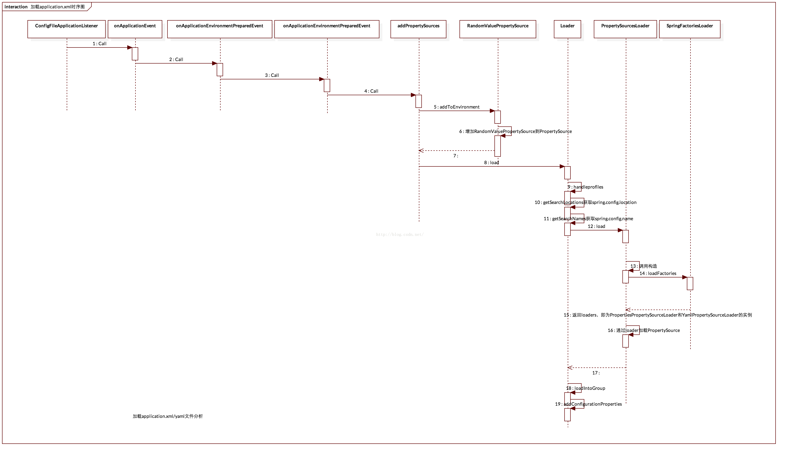

# SpringBoot实战之加载application资源文件源码分析

***
[toc]
***


@(SpringBoot)


本篇在此基础上学习spring boot如何默认加载application.xml等文件信息的:


## 时序图



仅供参考！先有点概念，等你看完这篇文章再回来看就很明朗了。

## ConfigFileApplicationListener


在[《SpringBoot入门及四种事件监听源码解析》](https://github.com/AmbitionLofty/Blog/blob/master/Java/SpringBoot/SpringBoot%E5%85%A5%E9%97%A8%E5%8F%8A%E5%9B%9B%E7%A7%8D%E4%BA%8B%E4%BB%B6%E7%9B%91%E5%90%AC.md)分析中可知在构造`SpringApplication`时加载相关的监听器，其中存在一个监听器`ConfigFileApplicationListener`，其定义如下：

```java

public class ConfigFileApplicationListener implements  
        ApplicationListener<ApplicationEvent>, Ordered {  
	@Override  
    public void onApplicationEvent(ApplicationEvent event) {  
        if (event instanceof ApplicationEnvironmentPreparedEvent) {  
            onApplicationEnvironmentPreparedEvent((ApplicationEnvironmentPreparedEvent) event);  
        }  
        if (event instanceof ApplicationPreparedEvent) {  
            onApplicationPreparedEvent((ApplicationPreparedEvent) event);  
        }  
    }  
   
}
```


监听`ApplicationEvent`事件，在触发所有其子类以及本身事件时会执行其`onApplicationEvent`方法。在执行

```java
for (SpringApplicationRunListener runListener : runListeners) {  
    runListener.environmentPrepared(environment);  
}
```

会触发到:

```java

if (event instanceof ApplicationEnvironmentPreparedEvent) {  
     onApplicationEnvironmentPreparedEvent((ApplicationEnvironmentPreparedEvent) event);  
   }  
```
其中`onApplicationEnvironmentPreparedEvent` 
```java
private void onApplicationEnvironmentPreparedEvent(  
            ApplicationEnvironmentPreparedEvent event) {  
        Environment environment = event.getEnvironment();  
        if (environment instanceof ConfigurableEnvironment) {  
            onApplicationEnvironmentPreparedEvent((ConfigurableEnvironment) environment,  
                    event.getSpringApplication());  
        }  
 }  
```


在之前的文章中可以知道`enviroment`为`StandardServletEnvironment`实例，因此执行`onApplicationEnvironmentPreparedEvent`方法：


```java
private void onApplicationEnvironmentPreparedEvent(  
            ConfigurableEnvironment environment, SpringApplication application) {  
        addPropertySources(environment, application.getResourceLoader());  
        bindToSpringApplication(environment, application);  
    }  
```


首先来看`addPropertySources`相关信息：

```java
protected void addPropertySources(ConfigurableEnvironment environment,  
            ResourceLoader resourceLoader) {  
        RandomValuePropertySource.addToEnvironment(environment);  
        try {  
            new Loader(environment, resourceLoader).load();  
        }  
        catch (IOException ex) {  
            throw new IllegalStateException("Unable to load configuration files", ex);  
        }  
    } 
```

`RandomValuePropertySource.addToEnvironment(environment)`使用随机方法放入到`PropertySource`：

```java
public static void addToEnvironment(ConfigurableEnvironment environment) {  
        environment.getPropertySources().addAfter(  
                StandardEnvironment.SYSTEM_ENVIRONMENT_PROPERTY_SOURCE_NAME,  
                new RandomValuePropertySource("random"));  
        logger.trace("RandomValuePropertySource add to Environment");  
    }  
```

如何从Random中获取值是需要看`getProperty`方法：


```java

public Object getProperty(String name) {  
        if (!name.startsWith("random.")) {  
            return null;  
        }  
        if (logger.isTraceEnabled()) {  
            logger.trace("Generating random property for '" + name + "'");  
        }  
        if (name.endsWith("int")) {  
            return getSource().nextInt();  
        }  
        if (name.startsWith("random.long")) {  
            return getSource().nextLong();  
        }  
        if (name.startsWith("random.int") && name.length() > "random.int".length() + 1) {  
            String range = name.substring("random.int".length() + 1);  
            range = range.substring(0, range.length() - 1);  
            return getNextInRange(range);  
        }  
        byte[] bytes = new byte[32];  
        getSource().nextBytes(bytes);  
        return DigestUtils.md5DigestAsHex(bytes);  
    }  
```
其中的`getSource()`表示Random类。
接下来看

```java
new Loader(environment, resourceLoader).load()  
```

看load方法:

```java
public void load() throws IOException {  
            ...//处理profiles信息  
              
            while (!this.profiles.isEmpty()) {  
                String profile = this.profiles.poll();  
                for (String location : getSearchLocations()) {  
                    if (!location.endsWith("/")) {  
                        // location is a filename already, so don't search for more  
                        // filenames  
                        load(location, null, profile);  
                    }  
                    else {  
                        for (String name : getSearchNames()) {  
                            load(location, name, profile);  
                        }  
                    }  
                }  
            }  
  
            addConfigurationProperties(this.propertiesLoader.getPropertySources());  
      }  
```
看`getSearchLocations()`方法:

```java
private Set<String> getSearchLocations() {  
            Set<String> locations = new LinkedHashSet<String>();  
            // User-configured settings take precedence, so we do them first  
            if (this.environment.containsProperty(CONFIG_LOCATION_PROPERTY)) {  
                for (String path : asResolvedSet(  
                        this.environment.getProperty(CONFIG_LOCATION_PROPERTY), null)) {  
                    if (!path.contains("$")) {  
                        if (!path.contains(":")) {  
                            path = "file:" + path;  
                        }  
                        path = StringUtils.cleanPath(path);  
                    }  
                    locations.add(path);  
                }  
            }  
            locations.addAll(asResolvedSet(  
                    ConfigFileApplicationListener.this.searchLocations,  
                    DEFAULT_SEARCH_LOCATIONS));  
            return locations;  
        }  
```

首先看`CONFIG_LOCATION_PROPERTY(spring.config.location)`是否存在配置，无则走默认配置路径`DEFAULT_SEARCH_LOCATIONS(classpath:/,classpath:/config/,file:./,file:./config/)`


继续来看`getSearchNames()`方法
```java
private Set<String> getSearchNames() {  
        if (this.environment.containsProperty(CONFIG_NAME_PROPERTY)) {  
            return asResolvedSet(this.environment.getProperty(CONFIG_NAME_PROPERTY),  
                    null);  
        }  
        return asResolvedSet(ConfigFileApplicationListener.this.names, DEFAULT_NAMES);  
    }  
```
优先看`CONFIG_NAME_PROPERTY(spring.config.name)`配置，否则走`DEFAULT_NAMES(application)`

解析完路径和配置文件名以后，将开始判断路径+名称组合是否存在  执行 load(...) 方法

```java

private void load(String location, String name, String profile)  
                throws IOException {  
            String group = "profile=" + (profile == null ? "" : profile);  
            if (!StringUtils.hasText(name)) {  
                // Try to load directly from the location  
                loadIntoGroup(group, location, profile);  
            }  
            else {  
                // Search for a file with the given name  
                for (String ext : this.propertiesLoader.getAllFileExtensions()) {  
                    if (profile != null) {  
                        // Try the profile specific file  
                        loadIntoGroup(group, location + name + "-" + profile + "." + ext,  
                                null);  
                        // Sometimes people put "spring.profiles: dev" in  
                        // application-dev.yml (gh-340). Arguably we should try and error  
                        // out on that, but we can be kind and load it anyway.  
                        loadIntoGroup(group, location + name + "-" + profile + "." + ext,  
                                profile);  
                    }  
                    // Also try the profile specific section (if any) of the normal file  
                    loadIntoGroup(group, location + name + "." + ext, profile);  
                }  
            }  
        }  

```


`this.propertiesLoader.getAllFileExtensions()`方法获取文件后缀:


```java
public Set<String> getAllFileExtensions() {  
        Set<String> fileExtensions = new HashSet<String>();  
        for (PropertySourceLoader loader : this.loaders) {  
            fileExtensions.addAll(Arrays.asList(loader.getFileExtensions()));  
        }  
        return fileExtensions;  
    }  
```

`loader.getFileExtensions()`获取所有支持的文件后缀，其中loader在执行load方法时实例化:


```java
public void load() throws IOException {  
            this.propertiesLoader = new PropertySourcesLoader();  
			...
}  
```

调用其构造方法:

```java
public PropertySourcesLoader(MutablePropertySources propertySources) {  
    Assert.notNull(propertySources, "PropertySources must not be null");  
    this.propertySources = propertySources;  
    this.loaders = SpringFactoriesLoader.loadFactories(PropertySourceLoader.class,  
            null);  
}  
```

可以看出`this.loaders`是由`SpringFactoriesLoader.loadFactories(PropertySourceLoader.class,null)`得到:


```java
public static <T> List<T> loadFactories(Class<T> factoryClass, ClassLoader classLoader) {  
    Assert.notNull(factoryClass, "'factoryClass' must not be null");  
    ClassLoader classLoaderToUse = classLoader;  
    if (classLoaderToUse == null) {  
        classLoaderToUse = SpringFactoriesLoader.class.getClassLoader();  
    }  
    List<String> factoryNames = loadFactoryNames(factoryClass, classLoaderToUse);  
    if (logger.isTraceEnabled()) {  
        logger.trace("Loaded [" + factoryClass.getName() + "] names: " + factoryNames);  
    }  
    List<T> result = new ArrayList<T>(factoryNames.size());  
    for (String factoryName : factoryNames) {  
        result.add(instantiateFactory(factoryName, factoryClass, classLoaderToUse));  
    }  
    AnnotationAwareOrderComparator.sort(result);  
    return result;  
}  
```

加载`META-INF/spring.factories`文件下对应内容:

```profile
# PropertySource Loaders  
org.springframework.boot.env.PropertySourceLoader=\  
org.springframework.boot.env.PropertiesPropertySourceLoader,\  
org.springframework.boot.env.YamlPropertySourceLoader  
```


因此加载了`PropertiesPropertySourceLoader`以及`YamlPropertySourceLoader`类实例；
- `PropertiesPropertySourceLoader` 支持文件后缀格式 `"properties","xml"`

```java
	@Override  
    public String[] getFileExtensions() {  
        return new String[] { "properties", "xml" };  
    }  
``` 

- `YamlPropertySourceLoader` 支持文件后缀格式 `"yml","yaml"`

```java
	@Override  
    public String[] getFileExtensions() {  
        return new String[] { "yml", "yaml" };  
    } 
```


**两者覆写的 load() 方法实现如何处理资源为PropertySource对象:**

获取完文件后缀后调用`loadIntoGroup`方法将资源信息转化为`PropertySource`，其实质为调用`PropertySourcesLoader`中load方法:


```java
private PropertySource<?> loadIntoGroup(String identifier, String location,  
                String profile) throws IOException {  
            Resource resource = this.resourceLoader.getResource(location);  
            PropertySource<?> propertySource = null;  
            if (resource != null) {  
                String name = "applicationConfig: [" + location + "]";  
                String group = "applicationConfig: [" + identifier + "]";  
                propertySource = this.propertiesLoader.load(resource, group, name,  
                        profile);  
                if (propertySource != null) {  
                    maybeActivateProfiles(propertySource  
                            .getProperty(ACTIVE_PROFILES_PROPERTY));  
                    addIncludeProfiles(propertySource  
                            .getProperty(INCLUDE_PROFILES_PROPERTY));  
                }  
            }  
            StringBuilder msg = new StringBuilder();  
            msg.append(propertySource == null ? "Skipped " : "Loaded ");  
            msg.append("config file ");  
            msg.append("'").append(location).append("'");  
            if (StringUtils.hasLength(profile)) {  
                msg.append(" for profile" + profile);  
            }  
            if (resource == null || !resource.exists()) {  
                msg.append(" resource not found");  
            }  
            this.debug.add(msg);  
            return propertySource;  
        }  
```


最后调用`addConfigurationProperties(this.propertiesLoader.getPropertySources())`方法将解析过后的资源信息放置进Enviroment中propertySources属性集合中:

```java
private void addConfigurationProperties(MutablePropertySources sources) {  
            List<PropertySource<?>> reorderedSources = new ArrayList<PropertySource<?>>();  
            for (PropertySource<?> item : sources) {  
                reorderedSources.add(item);  
            }  
            // Maybe we should add before the DEFAULT_PROPERTIES if it exists?  
            this.environment.getPropertySources().addLast(  
                    new ConfigurationPropertySources(reorderedSources));  
        }
```

至此 application.xml等文件的加载分析结束。

***

回头看时序图！！！！
***

OVER