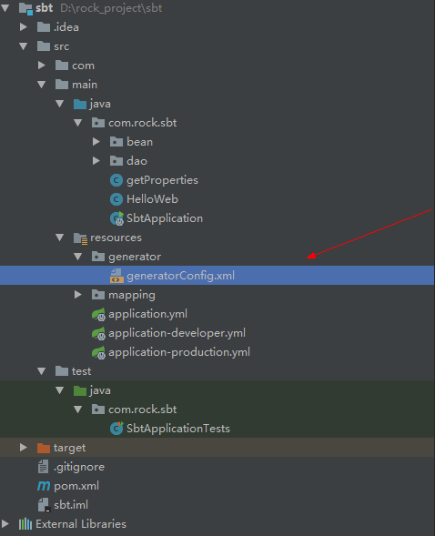
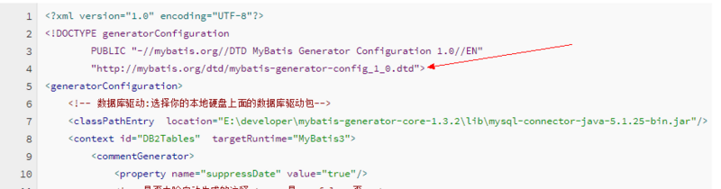
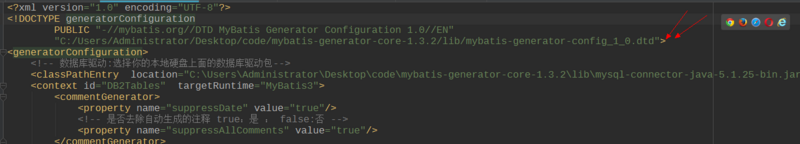
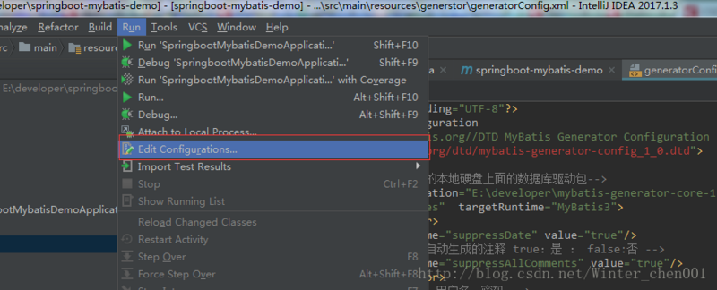
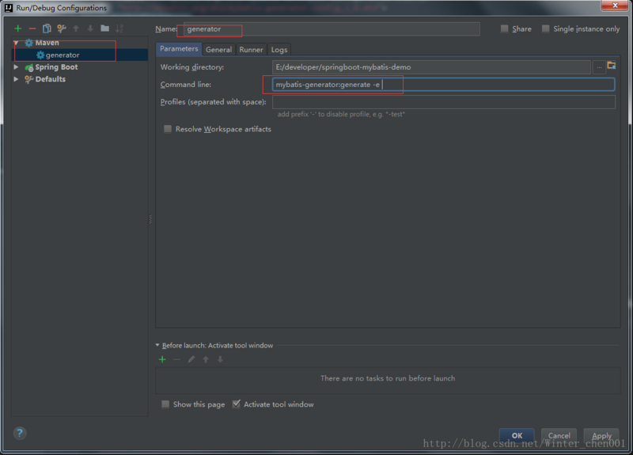
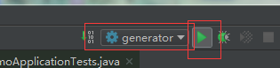
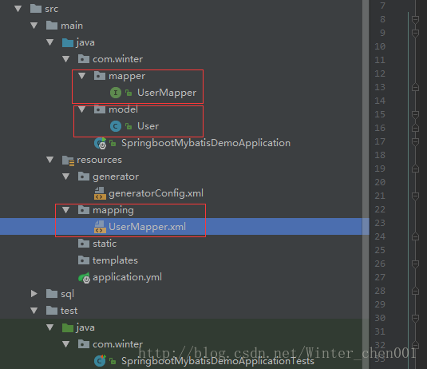
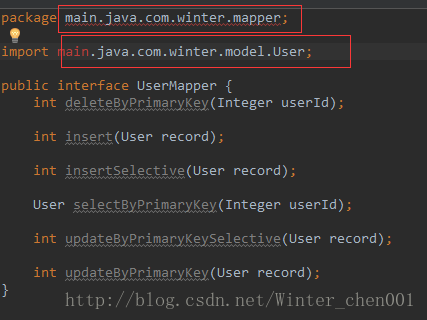
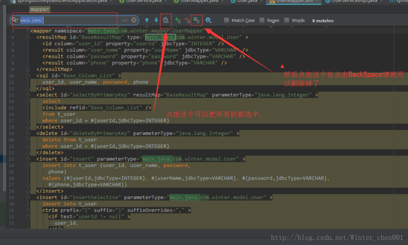

# 自动生成代码 快速使用Mybatis Generator整合到Idea中

@(实用开发技巧)


> 那有什么天生如此，只是我们天天坚持。


## 使用Mybatis Generator 整合到Idea中 自动生成代码


----------


## 1. 配置Maven pom.xml 文件

```

	<build>
		<plugins>
			<plugin>
				<groupId>org.springframework.boot</groupId>
				<artifactId>spring-boot-maven-plugin</artifactId>
			</plugin>
            <plugin>
                <groupId>org.mybatis.generator</groupId>
                <artifactId>mybatis-generator-maven-plugin</artifactId>
                <version>1.3.2</version>
                <configuration>
                    <configurationFile>${basedir}/src/main/resources/generator/generatorConfig.xml</configurationFile>
                    <overwrite>true</overwrite>
                    <verbose>true</verbose>
                </configuration>
            </plugin>
		</plugins>
	</build>

```

配置好Maven插件，下面需要配置插件需要配置文件


## 2.在maven项目下的src/main/resources 目录下建立名为 Maven的项目配置文件
存放路径如下图：generatorConfig.xml和generator.properties配置文件，和pom文件中地址对应




##**generatorConfig.xml代码如下**：

```
<?xml version="1.0" encoding="UTF-8"?>
<!DOCTYPE generatorConfiguration
        PUBLIC "-//mybatis.org//DTD MyBatis Generator Configuration 1.0//EN"
        "http://mybatis.org/dtd/mybatis-generator-config_1_0.dtd">
<generatorConfiguration>
    <!-- 数据库驱动:选择你的本地硬盘上面的数据库驱动包-->
    <classPathEntry  location="E:\developer\mybatis-generator-core-1.3.2\lib\mysql-connector-java-5.1.25-bin.jar"/>
    <context id="DB2Tables"  targetRuntime="MyBatis3">
        <commentGenerator>
            <property name="suppressDate" value="true"/>
            <!-- 是否去除自动生成的注释 true：是 ： false:否 -->
            <property name="suppressAllComments" value="true"/>
        </commentGenerator>
        <!--数据库链接URL，用户名、密码 -->
        <jdbcConnection driverClass="com.mysql.jdbc.Driver" connectionURL="jdbc:mysql://127.0.0.1/mytest" userId="root" password="root">
        </jdbcConnection>
        <javaTypeResolver>
            <property name="forceBigDecimals" value="false"/>
        </javaTypeResolver>
        <!-- 生成模型的包名和位置-->
        <javaModelGenerator targetPackage="main.java.com.winter.model" targetProject="src">
            <property name="enableSubPackages" value="true"/>
            <property name="trimStrings" value="true"/>
        </javaModelGenerator>
        <!-- 生成映射文件的包名和位置-->
        <sqlMapGenerator targetPackage="main.resources.mapping" targetProject="src">
            <property name="enableSubPackages" value="true"/>
        </sqlMapGenerator>
        <!-- 生成DAO的包名和位置-->
        <javaClientGenerator type="XMLMAPPER" targetPackage="main.java.com.winter.mapper" targetProject="src">
            <property name="enableSubPackages" value="true"/>
        </javaClientGenerator>
        <!-- 要生成的表 tableName是数据库中的表名或视图名 domainObjectName是实体类名-->
        <table tableName="t_user" domainObjectName="User" enableCountByExample="false" enableUpdateByExample="false" enableDeleteByExample="false" enableSelectByExample="false" selectByExampleQueryId="false"></table>
    </context>
</generatorConfiguration>
```


**注意事项**：




可能会出现无法访问的异常：
解决办法：下载`mybatis-generator-config_1_0.dtd`文件放在本地，此处写本地路径
在文章最后会有下在地址，：




生成文件的路径要写全路径名`targetPackage="main.java.com.winter.mapper"`  并且要已经创建。
 

## 构建
       1. `点击run-Edit Configurations`





     2. 添加配置




`mybatis-generator:generate -e`

后面带`-e `是有log打印  ，不带没有。

## 运行




## 后面




我们还需要修改有点东西，因为生成的类中的路径写了全路径，所以我们要把前面多余的删掉： 







下载地址：
链接：http://pan.baidu.com/s/1bptrqGJ 密码：lnp1
 


