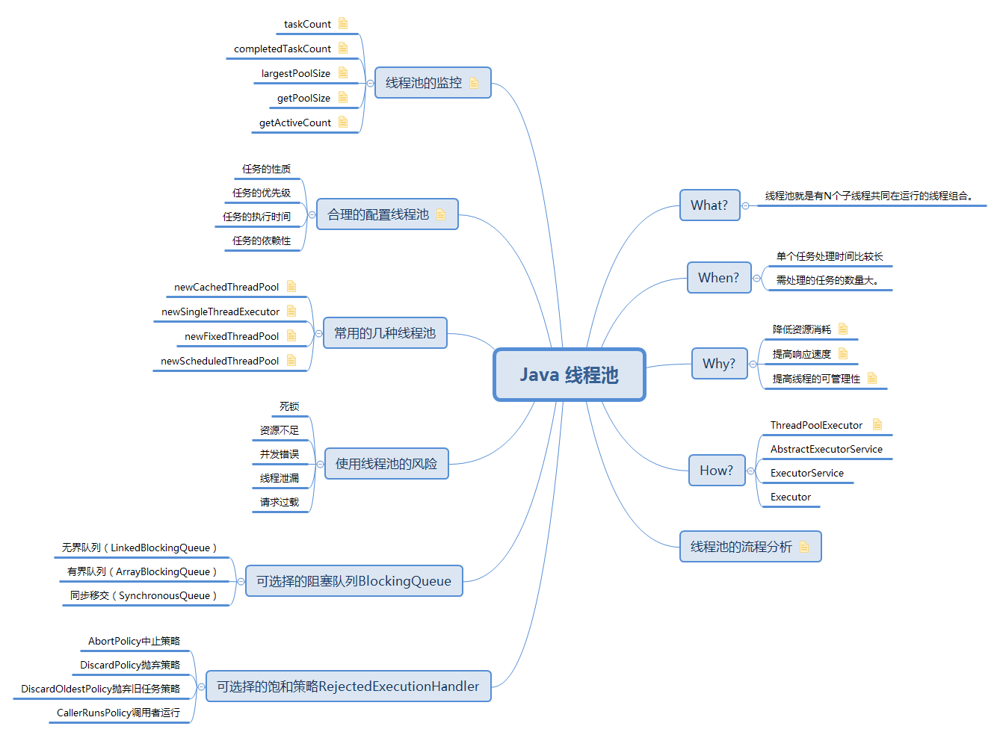
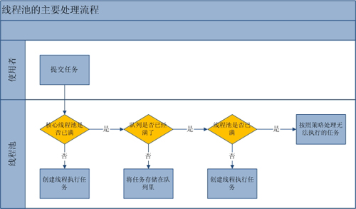

## Java线程池

@(高并发)


[toc]

##  导图




##  什么是线程池

**线程池就是有N个子线程共同在运行的线程组合**。

举个容易理解的例子：有个线程组合（即线程池，咱可以比喻为一个公司），里面有3个子线程（当作3个员工吧），待命干活。 
只要客户告诉他一个任务（比如搬砖）公司就会挑一个员工来做;

如果很多客户都找，3个忙不过来，那公司可以再雇2个人，但本公司运营能力有限，办公室也不大，最多就雇佣5个人，如果还忙不过来，那这些送来的任务就排队了。一件一件做完。


## ThreadPoolExecutor简介

`java.uitl.concurrent.ThreadPoolExecutor`类是线程池中最核心的一个类，因此如果要透彻地了解Java中的线程池，必须先了解这个类。下面我们来看一下ThreadPoolExecutor类的具体实现源码:


在**ThreadPoolExecutor**类中提供了四个构造方法：


```java
public class ThreadPoolExecutor extends AbstractExecutorService {
    .....
    public ThreadPoolExecutor(int corePoolSize,int maximumPoolSize,long keepAliveTime,TimeUnit unit,
            BlockingQueue<Runnable> workQueue);
 
    public ThreadPoolExecutor(int corePoolSize,int maximumPoolSize,long keepAliveTime,TimeUnit unit,
            BlockingQueue<Runnable> workQueue,ThreadFactory threadFactory);
 
    public ThreadPoolExecutor(int corePoolSize,int maximumPoolSize,long keepAliveTime,TimeUnit unit,
            BlockingQueue<Runnable> workQueue,RejectedExecutionHandler handler);
 
   
    public ThreadPoolExecutor(int corePoolSize,
                              int maximumPoolSize,
                              long keepAliveTime,
                              TimeUnit unit,
                              BlockingQueue<Runnable> workQueue,
                              ThreadFactory threadFactory,
                              RejectedExecutionHandler handler);
        
}

```


从上面的代码可以得知，**ThreadPoolExecutor**继承了**AbstractExecutorService**类，并提供了四个构造器，事实上，通过观察每个构造器的源码具体实现，发现前面三个构造器都是调用的第四个构造器进行的初始化工作。


 `corePoolSize` 线程池维护线程的最少数量。      
 
 >需要注意的是在初创建线程池时线程不会立即启动，直到有任务提交才开始启动线程并逐渐时线程数目达到`corePoolSize`。若想一开始就创建所有核心线程需调用`prestartAllCoreThreads`方法。

`maximumPoolSize`-池中允许的最大线程数。

>需要注意的是当核心线程满且阻塞队列也满时才会判断当前线程数是否小于最大线程数，并决定是否创建新线程。 
 
`keepAliveTime` - 线程池维护线程所允许的空闲时间 

>当线程数大于核心时，多于的空闲线程最多存活时间 
默认情况下，只有**当线程池中的线程数大于corePoolSize时，keepAliveTime才会起作用**，直到线程池中的线程数不大于corePoolSize。即当线程池中的线程数大于corePoolSize时，如果一个线程空闲的时间达到keepAliveTime，则会终止，直到线程池中的线程数不超过corePoolSize。但是如果调用了`allowCoreThreadTimeOut(boolean)`方法，在线程池中的线程数不大于corePoolSize时，keepAliveTime参数也会起作用，直到线程池中的线程数为0


`unit` - keepAliveTime 参数的时间单位，有7种取值。

```java
TimeUnit.DAYS;               //天
TimeUnit.HOURS;             //小时
TimeUnit.MINUTES;           //分钟
TimeUnit.SECONDS;           //秒
TimeUnit.MILLISECONDS;      //毫秒
TimeUnit.MICROSECONDS;      //微妙
TimeUnit.NANOSECONDS;       //纳秒
```

`workQueue` - 当线程数目超过核心线程数时用于保存任务的队列。主要有4种类型的 `BlockingQueue`可供选择：有界队列,无界队列和同步移交。
```java
ArrayBlockingQueue;  //有界队列
LinkedBlockingQueue; //无界队列
SynchronousQueue;  //同步移交
PriorityBlockingQueue; //一个具有优先级得无限阻塞队列。
```


`threadFactory` - 执行程序创建新线程时使用的工厂。 

`handler` - 阻塞队列已满且线程数达到最大值时所采取的**饱和策略**。java默认提供了4种饱和策略的实现方式：中止、抛弃、抛弃最旧的、调用者运行。
```java
ThreadPoolExecutor.AbortPolicy();  抛出java.util.concurrent.RejectedExecutionException异常 
ThreadPoolExecutor.CallerRunsPolicy();  重试添加当前的任务，他会自动重复调用execute()方法 
ThreadPoolExecutor.DiscardOldestPolicy(); 抛弃旧的任务  
ThreadPoolExecutor.DiscardPolicy();  抛弃当前的任务 
当然也可以根据应用场景需要来实现`RejectedExecutionHandler`接口自定义策略。如记录日志或持久化不能处理的任务。
```


### 向上翻源码

从上面给出的`ThreadPoolExecutor`类的代码可以知道，`ThreadPoolExecutor`继承了`AbstractExecutorService`，我们来看一下`AbstractExecutorService`的实现：


```java
public abstract class AbstractExecutorService implements ExecutorService {
 
    protected <T> RunnableFuture<T> newTaskFor(Runnable runnable, T value) { };
    protected <T> RunnableFuture<T> newTaskFor(Callable<T> callable) { };
    public Future<?> submit(Runnable task) {};
    public <T> Future<T> submit(Runnable task, T result) { };
    public <T> Future<T> submit(Callable<T> task) { };
    private <T> T doInvokeAny(Collection<? extends Callable<T>> tasks,
                            boolean timed, long nanos)
        throws InterruptedException, ExecutionException, TimeoutException {
    };
    public <T> T invokeAny(Collection<? extends Callable<T>> tasks)
        throws InterruptedException, ExecutionException {
    };
    public <T> T invokeAny(Collection<? extends Callable<T>> tasks,
                           long timeout, TimeUnit unit)
        throws InterruptedException, ExecutionException, TimeoutException {
    };
    public <T> List<Future<T>> invokeAll(Collection<? extends Callable<T>> tasks)
        throws InterruptedException {
    };
    public <T> List<Future<T>> invokeAll(Collection<? extends Callable<T>> tasks,
                                         long timeout, TimeUnit unit)
        throws InterruptedException {
    };
}
```


`AbstractExecutorService`是一个抽象类，它实现了`ExecutorService`接口。

我们接着看`ExecutorService`接口的实现：

```java
public interface ExecutorService extends Executor {
 
    void shutdown();
    boolean isShutdown();
    boolean isTerminated();
    boolean awaitTermination(long timeout, TimeUnit unit)throws InterruptedException;
    
    <T> Future<T> submit(Callable<T> task);
    
    <T> Future<T> submit(Runnable task, T result);
    
    Future<?> submit(Runnable task);
    
    <T> List<Future<T>> invokeAll(Collection<? extends Callable<T>> tasks)throws InterruptedException;
    
    <T> List<Future<T>> invokeAll(Collection<? extends Callable<T>> tasks,long timeout, TimeUnit unit)throws InterruptedException;
 
    <T> T invokeAny(Collection<? extends Callable<T>> tasks)throws InterruptedException, ExecutionException;
    
    <T> T invokeAny(Collection<? extends Callable<T>> tasks,long timeout, TimeUnit unit)throws InterruptedException, ExecutionException, TimeoutException;
}
```

而`ExecutorService`又是继承了`Executor`接口，我们看一下`Executor`接口的实现：

```java
public interface Executor {
    void execute(Runnable command);
}
```
到这里，大家应该明白了`ThreadPoolExecutor`、`AbstractExecutorService`、`ExecutorService`和`Executor`几个之间的关系了。

`Executor`是一个顶层接口，在它里面只声明了一个方法`execute(Runnable)`，返回值为void，参数为Runnable类型，从字面意思可以理解，**就是用来执行传进去的任务的**；

然后`ExecutorService`接口继承了`Executor`接口，并声明了一些方法：submit、invokeAll、invokeAny以及shutDown等；

抽象类`AbstractExecutorService`实现了`ExecutorService`接口，基本实现了ExecutorService中声明的所有方法；

在ThreadPoolExecutor类中有几个非常重要的方法：

```java
execute()
submit()
shutdown()
shutdownNow()
```


**execute()方法实际上是Executor中声明的方法，在ThreadPoolExecutor进行了具体的实现**，这个方法是ThreadPoolExecutor的核心方法，通过这个方法可以向线程池提交一个任务，交由线程池去执行。

**submit()方法是在ExecutorService中声明的方法，在AbstractExecutorService就已经有了具体的实现**，在ThreadPoolExecutor中并没有对其进行重写，这个方法也是用来向线程池提交任务的，但是它和execute()方法不同，它能够返回任务执行的结果，去看submit()方法的实现，会发现它实际上还是调用的execute()方法，只不过它利用了Future来获取任务执行结果。

**shutdown()和shutdownNow()是用来关闭线程池的**。

还有很多其他的方法比如：getQueue() 、getPoolSize()、getActiveCount()、getCompletedTaskCount()等获取与线程池相关属性的方法，自行查阅API。


## 线程池的流程分析

线程池的主要工作流程如下图：


从上图我们可以看出，当提交一个新任务到线程池时，线程池的处理流程如下：

1.  首先线程池判断**基本线程池**是否已满？没满，创建一个工作线程来执行任务。满了，则进入下个流程。
2. 其次线程池判断**工作队列**是否已满？没满，则将新提交的任务存储在工作队列里。满了，则进入下个流程。
3. 最后线程池判断**整个线程池**是否已满？没满，则创建一个新的工作线程来执行任务，满了，则交给饱和策略来处理这个任务。

#### 源码分析
线程池**执行任务**的方法如下：

```java
    public void execute(Runnable command) {

        if (command == null)
            throw new NullPointerException();

        //如果线程数小于基本线程数，则创建线程并执行当前任务
        if (poolSize >= corePoolSize || !addIfUnderCorePoolSize(command)) {

            //如线程数大于等于基本线程数或线程创建失败，则将当前任务放到工作队列中。
            if (runState == RUNNING && workQueue.offer(command)) {
                if (runState != RUNNING || poolSize == 0)
                    ensureQueuedTaskHandled(command);
            }
            
            //如果线程池不处于运行中或任务无法放入队列，并且当前线程数量小于最大允许的线程数量，则创建一个线程执行任务。
            else if (!addIfUnderMaximumPoolSize(command))

                //抛出RejectedExecutionException异常
                reject(command); // is shutdown or saturated
        }

    }
```

**工作线程**。线程池创建线程时，会将线程封装成工作线程Worker，Worker在执行完任务后，还会无限循环获取工作队列里的任务来执行。我们可以从Worker的run方法里看到这点：

```java
public void run() {
     try {
           Runnable task = firstTask;
           firstTask = null;
            while (task != null || (task = getTask()) != null) {
                    runTask(task);
                    task = null;
            }

      } finally {
             workerDone(this);
      }
}
```


## 合理的配置线程池


要想合理的配置线程池，就必须**首先分析任务特性**，可以从以下几个角度来进行分析：

 - 任务的性质：CPU密集型任务，IO密集型任务和混合型任务。
 - 任务的优先级：高，中和低。
 - 任务的执行时间：长，中和短。
 - 任务的依赖性：是否依赖其他系统资源，如数据库连接。
 - 任务性质不同的任务可以用不同规模的线程池分开处理。


**CPU密集型任务** 配置尽可能少的线程数量，如配置`Ncpu+1`个线程的线程池。

**IO密集型任务** 则由于需要等待IO操作，线程并不是一直在执行任务，则配置尽可能多的线程，如`2*Ncpu`。

**混合型的任务** 如果可以拆分，则将其拆分成一个CPU密集型任务和一个IO密集型任务，只要这两个任务执行的时间相差不是太大，那么分解后执行的吞吐率要高于串行执行的吞吐率，如果这两个任务执行时间相差太大，则没必要进行分解。

**我们可以通过`Runtime.getRuntime().availableProcessors()`方法获得当前设备的CPU个数。**


**优先级不同的任务可以使用优先级队列`PriorityBlockingQueue`来处理**。它可以让优先级高的任务先得到执行，需要注意的是如果一直有优先级高的任务提交到队列里，那么优先级低的任务可能永远不能执行。


执行时间不同的任务可以交给不同规模的线程池来处理，或者也可以使用优先级队列，让执行时间短的任务先执行。

**依赖数据库连接池的任务，因为线程提交SQL后需要等待数据库返回结果，如果等待的时间越长CPU空闲时间就越长，那么线程数应该设置越大，这样才能更好的利用CPU**。


建议使用**有界队列**，有界队列能增加系统的稳定性和预警能力，可以根据需要设大一点，比如几千。

别人的例子：
> 有一次我们组使用的后台任务线程池的队列和线程池全满了，不断的抛出抛弃任务的异常，通过排查发现是数据库出现了问题，导致执行SQL变得非常缓慢，因为后台任务线程池里的任务全是需要向数据库查询和插入数据的，所以导致线程池里的工作线程全部阻塞住，任务积压在线程池里。如果当时我们设置成无界队列，线程池的队列就会越来越多，有可能会撑满内存，导致整个系统不可用，而不只是后台任务出现问题。当然我们的系统所有的任务是用的单独的服务器部署的，而我们使用不同规模的线程池跑不同类型的任务，但是出现这样问题时也会影响到其他任务。

## 线程池的监控


**通过线程池提供的参数进行监控**。线程池里有一些属性在监控线程池的时候可以使用

--

`taskCount`：线程池需要执行的任务数量。

`completedTaskCount`：线程池在运行过程中已完成的任务数量。小于或等于taskCount。

`largestPoolSize`：线程池曾经创建过的最大线程数量。通过这个数据可以知道线程池是否满过。如等于线程池的最大大小，则表示线程池曾经满了。

`getPoolSize`:线程池的线程数量。如果线程池不销毁的话，**池里的线程不会自动销毁，所以这个大小只增不减**。

`getActiveCount`：获取活动的线程数。

通过扩展线程池进行监控。通过继承线程池并重写线程池的`beforeExecute，afterExecute,terminated`方法，我们可以在任务执行前，执行后和线程池关闭前干一些事情。

如监控任务的平均执行时间，最大执行时间和最小执行时间等。这几个方法在线程池里是空方法。如：


``protected void beforeExecute(Thread t, Runnable r) { }``


## 常用的几种线程池

**什么是 Executor 框架** ?  (面试题)

Executor框架在Java 5中被引入，Executor 框架是一个根据一组执行策略调用、调度、执行和控制的异步任务的框架。

Executor 框架包括：`线程池，Executor，Executors，ExecutorService，CompletionService，Future，Callable `等。

不过在java doc中，并不提倡我们直接使用`ThreadPoolExecutor`，而是使用`Executors`类中提供的几个静态方法来创建**四种线程池**：

>注意在全新的阿里编程规约里面不推荐使用`Executors`提供的静态方法创建线程。

- `newCachedThreadPool `**是一个可根据需要创建新线程的线程池**，创建一个可缓存线程池，如果线程池长度超过处理需要，可灵活回收空闲线程，若无可回收，则新建线程。。

```java
 ExecutorService cachedThreadPool = Executors.newCachedThreadPool();   
   cachedThreadPool.execute(new Runnable() {  
    public void run() {  
     System.out.println("runing.....");  
    }  
   });   
 }  
```

--
- `newSingleThreadExecutor` **创建是一个单线程池，也就是该线程池只有一个线程在工作，所有的任务是串行执行的**。如果这个唯一的线程因为异常结束，那么会有一个新的线程来替代它，此线程池保证所有任务的执行顺序按照任务的提交顺序执行。
```java
 ExecutorService singleThreadExecutor = Executors.newSingleThreadExecutor(););   
   singleThreadExecutor.execute(new Runnable() {  
    public void run() {  
     System.out.println("runing.....");  
    }  
   });   
 }  
```

--
- `newFixedThreadPool `**创建固定大小的线程池，每次提交一个任务就创建一个线程，直到线程达到线程池的最大大小**。线程池的大小一旦达到最大值就会保持不变，如果某个线程因为执行异常而结束，那么线程池会补充一个新线程。
定长线程池的大小最好根据系统资源进行设置。如`Runtime.getRuntime().availableProcessors()`

```java
 ExecutorService fixedThreadPool = Executors.newFixedThreadPool(3);   
   fixedThreadPool .execute(new Runnable() {  
    public void run() {  
     System.out.println("runing.....");  
    }  
   });   
 }  
```

--

- `newScheduledThreadPool` **创建一个定长线程池，支持定时及周期性任务执行**。

```java
 ScheduledExecutorService scheduledThreadPool = Executors.newScheduledThreadPool(5);    
   scheduledThreadPool.schedule(new Runnable() {  
    public void run() {  
     System.out.println("runing.....");  
    }  
   }, 3, TimeUnit.SECONDS);   // 表示延迟3秒执行。
 }  
```


## 使用线程池的风险

虽然线程池是构建多线程应用程序的强大机制，**但使用它并不是没有风险的**。

用线程池构建的应用程序容易遭受任何其它多线程应用程序容易遭受的所有并发风险，诸如**同步错误和死锁**，它还容易遭受特定于线程池的少数其它风险，诸如与池有关的死锁、资源不足和线程泄漏。

####死锁
**任何多线程应用程序都有死锁风险**。当一组进程或线程中的每一个都在等待一个只有该组中另一个进程才能引起的事件时，我们就说这组进程或线程 死锁了。

死锁的最简单情形是：线程 A 持有对象 X 的独占锁，并且在等待对象 Y 的锁，而线程 B 持有对象 Y 的独占锁，却在等待对象 X 的锁。除非有某种方法来打破对锁的等待（Java 锁定不支持这种方法），否则死锁的线程将永远等下去。

虽然任何多线程程序中都有死锁的风险，但线程池却引入了另一种死锁可能，在那种情况下，所有池线程都在执行已阻塞的等待队列中另一任务的执行结果的任务，但这一任务却因为没有未被占用的线程而不能运行。
当线程池被用来实现涉及许多交互对象的模拟，被模拟的对象可以相互发送查询，这些查询接下来作为排队的任务执行，查询对象又同步等待着响应时，会发生这种情况。

####资源不足

线程池的一个优点在于：相对于其它替代调度机制言，它们通常执行得很好。**但只有恰当地调整了线程池大小时才是这样的**。线程消耗包括内存和其它系统资源在内的大量资源。除了 Thread 对象所需的内存之外，每个线程都需要两个可能很大的执行调用堆栈。除此以外，JVM 可能会为每个 Java 线程创建一个本机线程，这些本机线程将消耗额外的系统资源。最后，虽然线程之间切换的调度开销很小，但如果有很多线程，环境切换也可能严重地影响程序的性能。

**如果线程池太大，那么被那些线程消耗的资源可能严重地影响系统性能。在线程之间进行切换将会浪费时间，而且使用超出比您实际需要的线程可能会引起资源匮乏问题，**因为池线程正在消耗一些资源，而这些资源可能会被其它任务更有效地利用。除了线程自身所使用的资源以外，服务请求时所做的工作可能需要其它资源，例如 JDBC 连接、套接字或文件。
这些也都是有限资源，有太多的并发请求也可能引起失效，例如不能分配 JDBC 连接。

#### 并发错误

线程池和其它排队机制依靠使用 `wait()` 和 `notify()` 方法，这两个方法都难于使用。如果编码不正确，那么可能丢失通知，导致线程保持空闲状态，尽管队列中有工作要处理。使用这些方法时，必须格外小心。而最好使用现有的、已经知道能工作的实现，例如 util.concurrent 包。


#### 线程泄漏

**各种类型的线程池中一个严重的风险是线程泄漏，当从池中除去一个线程以执行一项任务，而在任务完成后该线程却没有返回池时，会发生这种情况**。发生线程泄漏的一种情形出现在任务抛出一个` RuntimeException `或一个 `Error `时。如果池类没有捕捉到它们，那么线程只会退出而线程池的大小将会永久减少一个。当这种情况发生的次数足够多时，线程池最终就为空，而且系统将停止，因为没有可用的线程来处理任务。

有些任务可能会永远等待某些资源或来自用户的输入，而这些资源又不能保证变得可用，用户可能也已经回家了，诸如此类的任务会永久停止，而这些停止的任务也会引起和线程泄漏同样的问题。如果某个线程被这样一个任务永久地消耗着，那么它实际上就被从池除去了。对于这样的任务，**应该要么只给予它们自己的线程，要么只让它们等待有限的时间**。


####请求过载

仅仅是请求就压垮了服务器，这种情况是可能的。在这种情形下，我们可能不想将每个到来的请求都排队到我们的工作队列，因为排在队列中等待执行的任务可能会消耗太多的系统资源并引起资源缺乏。在这种情形下决定如何做取决于您自己；在某些情况下，您可以简单地抛弃请求，依靠更高级别的协议稍后重试请求，您也可以用一个指出服务器暂时很忙的响应来拒绝请求。


## 可选择的阻塞队列BlockingQueue详解

重复看一下新任务进入时线程池的执行策略： 
1. 如果运行的线程少于`corePoolSize`，则` Executor`始终首选添加新的线程，而不进行排队。
2. 如果运行的线程大于等于` corePoolSize`，则` Executor`始终首选将请求加入队列，而不添加新的线程。 
3. 如果无法将请求加入队列，则创建新的线程，除非创建此线程超出 `maximumPoolSize`，在这种情况下，任务将被拒绝。 

主要有3种类型的`BlockingQueue`：

####无界队列

队列大小无限制，常用的为无界的`LinkedBlockingQueue`，将导致在所有` corePoolSize` 线程都忙时新任务在队列中等待。这样，创建的线程就不会超过` corePoolSize`。

**应用场景**：当每个任务完全独立于其他任务，即任务执行互不影响时，适合于使用无界队列。
例如，在 Web 页服务器中。这种排队可用于处理瞬态突发请求，当命令以超过队列所能处理的平均数连续到达时，此策略允许无界线程具有增长的可能性。

#### 有界队列
常用的有两类，一类是`遵循FIFO原则的队列如ArrayBlockingQueue与有界的LinkedBlockingQueue`，另一类是优先级队列如`PriorityBlockingQueue`。PriorityBlockingQueue中的优先级由任务的Comparator决定。 

使用有界队列时队列大小需和线程池大小互相配合，线程池较小有界队列较大时可减少内存消耗，降低cpu使用率和上下文切换，但是可能会限制系统吞吐量。

当使用有限的 `maximumPoolSizes` 时，有界队列（如 `ArrayBlockingQueue`）有助于防止资源耗尽，但是可能较难调整和控制。队列大小和最大池大小可能需要相互折衷，使用大型队列和小型池可以最大限度地降低 CPU 使用率、操作系统资源和上下文切换开销，但是可能导致人工降低吞吐量。

如果任务频繁阻塞（例如，如果它们是 I/O 边界），则系统可能为超过您许可的更多线程安排时间。使用小型队列通常要求较大的池大小，CPU 使用率较高，但是可能遇到不可接受的调度开销，这样也会降低吞吐量。

#### 同步移交

(直接提交) 如果不希望任务在队列中等待而是希望将任务直接移交给工作线程，可使用`SynchronousQueue`作为等待队列。`SynchronousQueue`不是一个真正的队列，而是一种线程之间移交的机制。要将一个元素放入`SynchronousQueue`中，必须有另一个线程正在等待接收这个元素。只有在使用无界线程池或者有饱和策略时才建议使用该队列。

工作队列的默认选项是 `SynchronousQueue`，此策略可以 **避免在处理可能具有内部依赖性的请求集时出现锁**。

该Queue本身的特性，**在某次添加元素后必须等待其他线程取走后才能继续添加**。

## 可选择的饱和策略RejectedExecutionHandler详解

JDK主要提供了4种饱和策略供选择。4种策略都做为静态内部类在`ThreadPoolExcutor`中进行实现。

#### AbortPolicy中止策略
```java
public void rejectedExecution(Runnable r, ThreadPoolExecutor e) {
            throw new RejectedExecutionException("Task " + r.toString() +
                                                 " rejected from " +
                                                 e.toString());
        }
```
使用该策略时在饱和时会抛出`RejectedExecutionException（继承自RuntimeException）`，调用者可捕获该异常自行处理。

#### DiscardPolicy抛弃策略

```java
public void rejectedExecution(Runnable r, ThreadPoolExecutor e) {
        }
```

如代码所示，不做任何处理直接抛弃任务

#### DiscardOldestPolicy抛弃旧任务策略

```java
public void rejectedExecution(Runnable r, ThreadPoolExecutor e) {
            if (!e.isShutdown()) {
                e.getQueue().poll();
                e.execute(r);
            }
        }
```

如代码，**先将阻塞队列中的头元素出队抛弃，再尝试提交任务**。如果此时阻塞队列使用`PriorityBlockingQueue`优先级队列，将会导致优先级最高的任务被抛弃，因此不建议将该种策略配合优先级队列使用。

#### CallerRunsPolicy调用者运行

```java
public void rejectedExecution(Runnable r, ThreadPoolExecutor e) {
            if (!e.isShutdown()) {
                r.run();
            }
        }
```

**既不抛弃任务也不抛出异常，直接运行任务的run方法**，换言之将任务回退给调用者来直接运行。使用该策略时线程池饱和后将由调用线程池的主线程自己来执行任务，因此在执行任务的这段时间里主线程无法再提交新任务，从而使线程池中工作线程有时间将正在处理的任务处理完成。