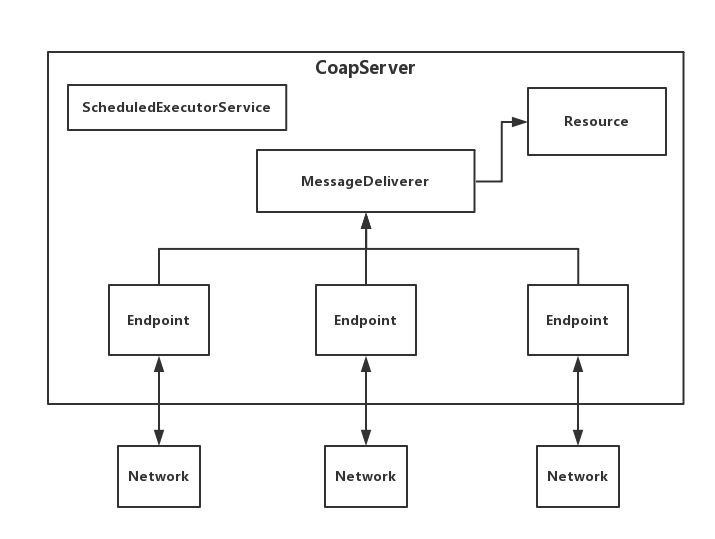
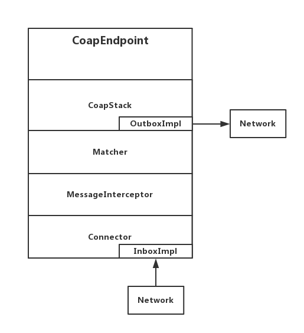
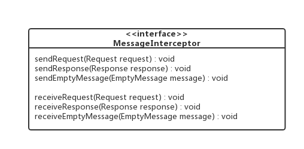
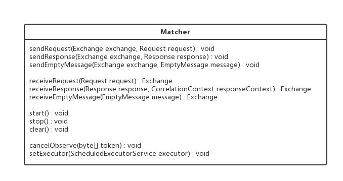
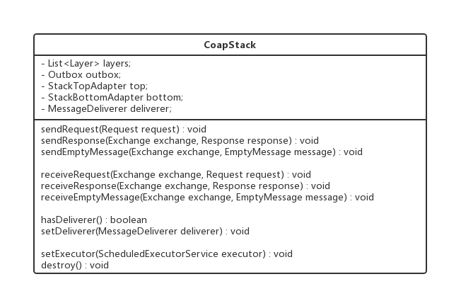
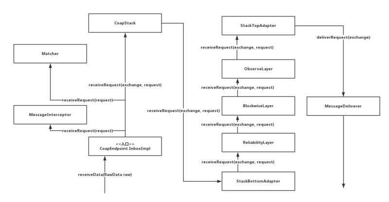
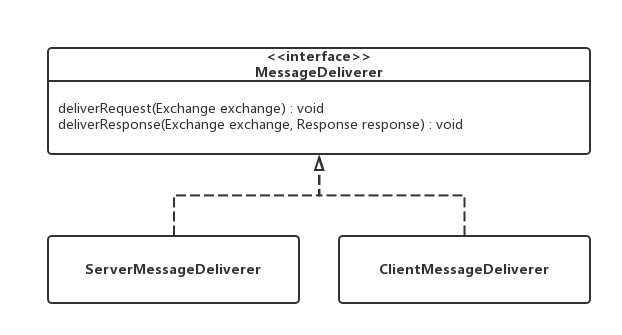
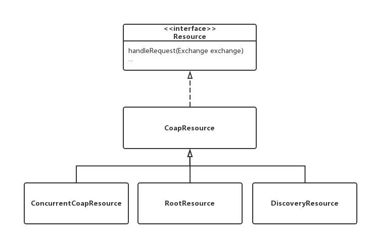
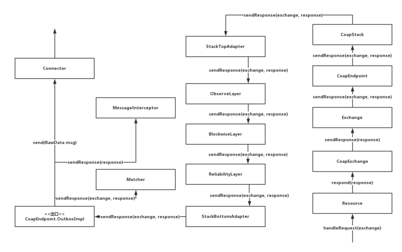

# 物联网协议之CoAP协议开发学习笔记之Californium开源框架分析(入门)

> 哪有什么天生如此，只是我们天天坚持。 -Zhiyuan

@(物联网)
***
[TOC]

***

以前我已经总结了CoAP协议的基础理论知识。没看过的朋友可以出门左转看我的文章


关于CoAP 协议有很多开源代码实现：大家可以参考我的文章选择自己最适合的：

## Californium 
Let's go!


引入Californium开源框架的依赖```californium-core```

启动服务端:

```
public static void main(String[] args) {

        // 创建服务端
        CoapServer server = new CoapServer();
        // 启动服务端
        server.start();

}
```
让我们从CoapServer这个类开始，对整个框架进行分析。首先让我们看看构造方法`CoapServer()`里面做了什么：

```
public CoapServer(final NetworkConfig config, final int... ports) {
    
    // 初始化配置	
    if (config != null) {
        this.config = config;
    } else {
        this.config = NetworkConfig.getStandard();
    }

    // 初始化Resource
    this.root = createRoot();

    // 初始化MessageDeliverer
    this.deliverer = new ServerMessageDeliverer(root);

    CoapResource wellKnown = new CoapResource(".well-known");
    wellKnown.setVisible(false);
    wellKnown.add(new DiscoveryResource(root));
    root.add(wellKnown);

    // 初始化EndPoints
    this.endpoints = new ArrayList<>();

    // 初始化线程池
    this.executor = Executors.newScheduledThreadPool(this.config.getInt(NetworkConfig.Keys.PROTOCOL_STAGE_THREAD_COUNT), new NamedThreadFactory("CoapServer#")); 

    // 添加Endpoint
    for (int port : ports) {
        addEndpoint(new CoapEndpoint(port, this.config));
    }
}
```
构造方法初始化了一些成员变量。其中，Endpoint负责与网络进行通信，`MessageDeliverer`负责分发请求，`Resource`负责处理请求。接着让我们看看启动方法`start()`又做了哪些事：

```
public void start() {

    // 如果没有一个Endpoint与CoapServer进行绑定，那就创建一个默认的Endpoint
    ...

    // 一个一个地将Endpoint启动
    int started = 0;
    for (Endpoint ep:endpoints) {
        try {
            ep.start();
            ++started;
        } catch (IOException e) {
            LOGGER.log(Level.SEVERE, "Cannot start server endpoint [" + ep.getAddress() + "]", e);
        }
    }
    if (started==0) {
        throw new IllegalStateException("None of the server endpoints could be started");
    }
}
```
启动方法很简单，主要是将所有的Endpoint一个个启动。至此，服务端算是启动成功了。让我们稍微总结一下几个类的关系




如上图，消息会从`Network模块`传输给对应的`Endpoint节点`，所有的Endpoint节点都会将消息推给MessageDeliverer，`MessageDeliverer`根据消息的内容传输给指定的Resource，`Resource`再对消息内容进行处理。
                
接下来，将让我们再模拟一个客户端发起一个GET请求，看看服务端是如何接收和处理的吧！客户端代码如下：


```
public static void main(String[] args) throws URISyntaxException {
        
    // 确定请求路径
    URI uri = new URI("127.0.0.1");

    // 创建客户端
    CoapClient client = new CoapClient(uri);
    
    // 发起一个GET请求
    client.get();

}
```

通过前面分析，我们知道Endpoint是直接与网络进行交互的，那么客户端发起的GET请求，应该在服务端的Endpoint中收到。框架中Endpoint接口的实现类只有`CoapEndpoint`，让我们深入了解一下CoapEndpoint的内部实现，看看它是如何接收和处理请求的。


## CoapEndpoint类
CoapEndpoint类实现了Endpoint接口，其构造方法如下：

```
public CoapEndpoint(Connector connector, NetworkConfig config, ObservationStore store) {
    this.config = config;
    this.connector = connector;
    if (store == null) {
        this.matcher = new Matcher(config, new NotificationDispatcher(), new InMemoryObservationStore());
    } else {
        this.matcher = new Matcher(config, new NotificationDispatcher(), store);
    }
    this.coapstack = new CoapStack(config, new OutboxImpl());
    this.connector.setRawDataReceiver(new InboxImpl());
}
```
从构造方法可以了解到，其内部结构如下所示：



那么，也就是说客户端发起的GET请求将被InboxImpl类接收。`InboxImpl`类实现了`RawDataChannel`接口，该接口只有一个`receiveData(RawData raw)`方法，InboxImpl类的该方法如下：

    public void receiveData(final RawData raw) {
    
        // 参数校验
        ...
    
        // 启动线程处理收到的消息
        runInProtocolStage(new Runnable() {
            @Override
            public void run() {
                receiveMessage(raw);
            }
        });
    
    }

再往`receiveMessage(RawData raw)`方法里看：

```
private void receiveMessage(final RawData raw) {
    
    // 解析数据源
    DataParser parser = new DataParser(raw.getBytes());

    // 如果是请求数据
    if (parser.isRequest()) {
        // 一些非关键操作
        ...
        
        // 消息拦截器接收请求
        for (MessageInterceptor interceptor:interceptors) {
            interceptor.receiveRequest(request);
        }
    
        // 匹配器接收请求，并返回Exchange对象
        Exchange exchange = matcher.receiveRequest(request);
        
        // Coap协议栈接收请求
        coapstack.receiveRequest(exchange, request);
    }
    
    // 如果是响应数据，则与请求数据一样，分别由消息拦截器、匹配器、Coap协议栈接收响应
    ...

    // 如果是空数据，则与请求数据、响应数据一样，分别由消息拦截器、匹配器、Coap协议栈接收空数据
    ...
    
    // 一些非关键操作
    ...

}
```
接下来，我们分别对`MessageInterceptor`（消息拦截器）、`Matcher`（匹配器）、`CoapStack`（Coap协议栈）进行分析，看看他们接收到请求后做了什么处理。

## MessageInterceptor接口





框架本身并没有提供该接口的任何实现类，我们可以根据业务需求实现该接口，并通过`CoapEndpoint.addInterceptor(MessageInterceptor interceptor)`方法添加具体的实现类。


## Matcher类





我们主要看`receiveRequest(Request request)`方法，看它对客户端的GET请求做了哪些操作：

```
public Exchange receiveRequest(Request request) {

    // 根据Request请求，填充并返回Exchange对象
    ...

}
```

## CoapStack类


CoapStack的类图比较复杂，其结构可以简化为下图：





有人可能会疑惑，这个结构图是怎么来，答案就在构造方法里：

```
public CoapStack(NetworkConfig config, Outbox outbox) {

    // 初始化栈顶
    this.top = new StackTopAdapter();
    
    // 初始化栈底
    this.bottom = new StackBottomAdapter();
    
    // 初始化出口
    this.outbox = outbox;

    // 初始化ReliabilityLayer
    ...

    // 初始化层级
    this.layers = 
        new Layer.TopDownBuilder()
        .add(top)
        .add(new ObserveLayer(config))
        .add(new BlockwiseLayer(config))
        .add(reliabilityLayer)
        .add(bottom)
        .create();

}
```
回归正题，继续看`CoapStack.receiveRequest(Exchange exchange, Request request)`方法是怎么处理客户端的GET请求：

```
public void receiveRequest(Exchange exchange, Request request) {
    bottom.receiveRequest(exchange, request);
}
```
CoapStack在收到请求后，交给了StackBottomAdapter去处理，StackBottomAdapter处理完后就会依次向上传递给ReliabilityLayer、BlockwiseLayer、ObserveLayer，最终传递给StackTopAdapter。中间的处理细节就不详述了，直接看`StackTopAdapter.receiveRequest(Exchange exchange, Request request)`方法：


```
public void receiveRequest(Exchange exchange, Request request) {

    // 一些非关键操作
    ...
    
    // 将请求传递给消息分发器
    deliverer.deliverRequest(exchange);
    
}
```

可以看到，StackTopAdapter最后会将请求传递给MessageDeliverer，至此CoapEndpoint的任务也就算完成了，我们可以通过一张请求消息流程图来回顾一下，一个客户端GET请求最终是如何到达MessageDeliverer的：




## MessageDeliverer接口





框架有ServerMessageDeliverer和ClientMessageDeliverer两个实现类。从CoapServer的构造方法里知道使用的是ServerMessageDeliverer类。那么就让我们看看ServerMessageDeliverer.deliverRequest(Exchange exchange)方法是如何分发GET请求的：


```
public void deliverRequest(final Exchange exchange) {

    // 从exchange里获取request
    Request request = exchange.getRequest();
    
    // 从request里获取请求路径
    List<String> path = request.getOptions().getUriPath();
    
    // 找出请求路径对应的Resource
    final Resource resource = findResource(path);
    
    // 一些非关键操作
    ...
    
    // 由Resource来真正地处理请求
    resource.handleRequest(exchange);
    
    // 一些非关键操作
    ...
	
}
```

当MessageDeliverer找到Request请求对应的Resource资源后，就会交由Resource资源来处理请求。（是不是很像Spring MVC中的DispatcherServlet，它也负责分发请求给对应的Controller，再由Controller自己处理请求）

## Resource接口





还记得CoapServer构造方法里创建了一个RootResource吗？它的资源路径为空，而客户端发起的GET请求默认也是空路径。那么ServerMessageDeliverer就会把请求分发给RootResource处理。RootResource类没有覆写`handleRequest(Exchange exchange)`方法，所以我们看看CoapResource父类的实现：


```
public void handleRequest(final Exchange exchange) {
    Code code = exchange.getRequest().getCode();
    switch (code) {
        case GET:	handleGET(new CoapExchange(exchange, this)); break;
        case POST:	handlePOST(new CoapExchange(exchange, this)); break;
        case PUT:	handlePUT(new CoapExchange(exchange, this)); break;
        case DELETE: handleDELETE(new CoapExchange(exchange, this)); break;
    }
}
```

由于我们客户端发起的是GET请求，那么将会进入到`RootResource.handleGET(CoapExchange exchange)`方法：

```
public void handleGET(CoapExchange exchange) {
    // 由CoapExchange返回响应
    exchange.respond(ResponseCode.CONTENT, msg);
}
```

再接着看`CoapExchange.respond(ResponseCode code, String payload)`方法：

```
public void respond(ResponseCode code, String payload) {

    // 生成响应并赋值
    Response response = new Response(code);
    response.setPayload(payload);
    response.getOptions().setContentFormat(MediaTypeRegistry.TEXT_PLAIN);
    
    // 调用同名函数
    respond(response);
    
}
```
看看同名函数里又做了哪些操作：

```
public void respond(Response response) {

    // 参数校验
    ...
    
    // 设置Response属性
    ...
    
    // 检查关系
    resource.checkObserveRelation(exchange, response);

    // 由成员变量Exchange发送响应
    exchange.sendResponse(response);

}
```

那么Exchange.sendResponse(Response response)又是如何发送响应的呢？

```
public void sendResponse(Response response) {

    // 设置Response属性
    response.setDestination(request.getSource());
    response.setDestinationPort(request.getSourcePort());
    setResponse(response);
    
    // 由Endpoint发送响应
    endpoint.sendResponse(this, response);

}
```

原来最终还是交给了Endpoint去发送响应了啊！之前的GET请求就是从Endpoint中来的。这真是和达康书记一样，从人民中来，再到人民中去。

在CoapEndpoint类一章节中我们有介绍它的内部结构。那么当发送响应的时候，将与之前接收请求相反，先由StackTopAdapter处理、再是依次ObserveLayer、BlockwiseLayer、ReliabilityLayer处理，最后由StackBottomAdapter处理，中间的细节还是老样子忽略，让我们直接看`StackBottomAdapter.sendResponse(Exchange exchange, Response response)`方法：

```
public void sendResponse(Exchange exchange, Response response) {
    outbox.sendResponse(exchange, response);
}
```

请求入口是CoapEndpoint.InboxImpl，而响应出口是CoapEndpint.OutboxImpl，简单明了。最后，让我们看看`OutboxImpl.sendResponse(Exchange exchange, Response response)`吧：


    public void sendResponse(Exchange exchange, Response response) {
    
        // 一些非关键操作
        ...
        
        // 匹配器发送响应
        matcher.sendResponse(exchange, response);
    
        // 消息拦截器发送响应
        for (MessageInterceptor interceptor:interceptors) {
            interceptor.sendResponse(response);
        }
        
        // 真正地发送响应到网络里
        connector.send(Serializer.serialize(response));
        
    }


通过一张响应消息流程图来回顾一下，一个服务端响应最终是如何传输到网络里去：





## 总结

通过服务端的创建和启动，客户端发起GET请求，服务端接收请求并返回响应流程，我们对Californium框架有了一个整体的了解。俗话说，师父领进门，修行看个人。在分析这个流程的过程中，我省略了很多的细节，意在让大家对框架有个概念上的理解，在以后二次开发或定位问题时更能抓住重点，着重针对某个模块。最后，也不得不赞叹一下这款开源框架代码逻辑清晰，模块职责划分明确，灵活地使用设计模式，非常值得我们学习！


>[ RFC7252-《受限应用协议》中文版.md](https://github.com/WildDogTeam/contribute/blob/master/source/RFC7252-%E3%80%8A%E5%8F%97%E9%99%90%E5%BA%94%E7%94%A8%E5%8D%8F%E8%AE%AE%E3%80%8B%E4%B8%AD%E6%96%87%E7%89%88.md)
>[californium 框架设计分析](http://www.cnblogs.com/littleatp/p/6417567.html)


如果对你有帮助，点赞收藏手有余香！


