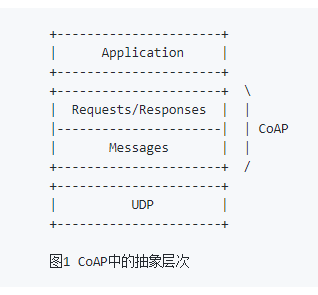
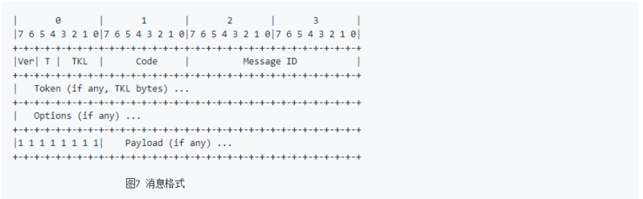
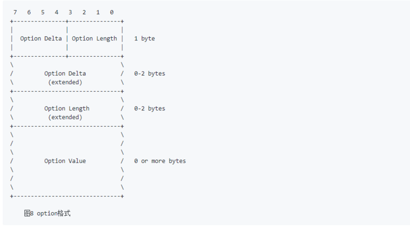
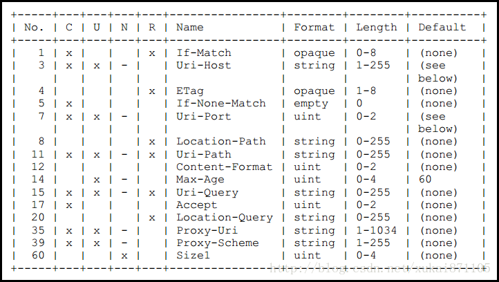
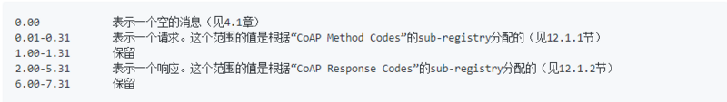
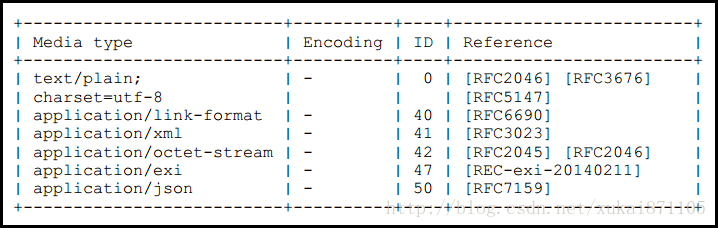
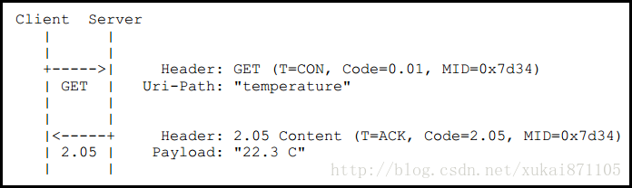
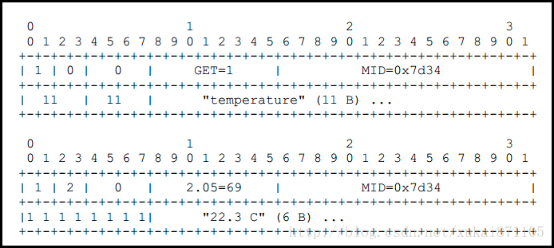

# 物联网协议之CoAP协议开发学习笔记之协议详解


> 哪有什么天生如此，只是我们天天坚持。 -Zhiyuan

@(物联网)
***
[TOC]

***


续上篇文章《物联网协议之CoAP协议开发学习笔记》 没看过的同学可以出门左转。https://segmentfault.com/a/1190000011516219
在进入正题之前强烈建议先看一下关于CoAP协议的一些术语，我已经为大家准备好了


这篇文章我们进入正题详解一下CoAP协议：

 CoAP协议的交互模型
----
**CoAP协议**的交互模型与HTTP的客户端/服务端模型类似。
然而，在M2M的交互场景中，一个使用CoAP协议的设备**通常既是客户端又是服务端**。
CoAP中的请求与HTTP协议中的请求相同，是由客户端发起的，请求一个位于服务端的资源（用URI标识），执行一个动作（用Method Code标识）。然后服务端发回一个响应，带有一个响应代码（Response Code），这个响应中有可能也包含一个资源的表现（附带响应格式）。

**与HTTP协议不同的是**，CoAP的交互是**异步**的，构建于面向数据报的传输协议，如UDP。
**交互是通过一个消息层来实现的**，消息层提供了可选的可靠性支持（采用指数回退）。
**CoAP协议中定义了四种类型的消息： CON, NON, ACK和RST。(下文有介绍)**这四种类型的消息中包含有请求和响应标识码，标识着这些消息是请求还是响应。请求可以包含在CON和NON两种类型中，而响应则除了可以包含在CON和NON之中，还可以包含在附带响应的ACK中。
    
**从逻辑上**，可以把CoAP协议划分为两层：

 1. **消息层**
    消息层，用于处理UDP数据包和异步；
 2. 请求/响应层
    请求/响应层，使用Method和Response Code，具体见图1。





当然，CoAP是一个协议，消息和请求/响应仅仅是其头部特性。


## CoAP的四种消息类型
 - **CON**——**需要被确认的请求**，如果CON请求被发送，那么对方必须做出响应。
 - **NON**——**不需要被确认的请求**，如果NON请求被发送，那么对方不必做出回应。
 - **ACK**——**应答消息**，接受到CON消息的响应。
 - **RST**——**复位消息**，当接收者接受到的消息包含一个错误，接受者解析消息或者不再关心发送者发送的内容，那么复位消息将会被发送。


## CoAP消息结构

**CoAP的消息格式是很紧凑的，默认运行在UDP上（每个CoAP消息都是UDP数据包中的数据部分）。**
CoAP也可以运行在DTLS协议上（见9.1节）和其它传输协议上，例如SMS，TCP或SCTP，这些不属于本文档的范畴（CoAP不支持UDP-lite[RFC3828]和UDP zero checksum[RFC6936]）。

**CoAP消息用二进制格式进行编码。**    这个消息格式以一个**固定4个字节的头部开始**。
此后是一个**长度在0到8字节之间的Token**。Token值之后是**0个或多个Type-Length-Value(TLV)格式的选项(Option)**。之后到整个数据报的结尾都是payload部分，payload可以为空。





头部字段定义如下：

 - **版本号(Ver)**
    2-bit无符号整型，**代表CoAP版本号**。本文档(7252)的实现必须设置这个字段为0b01。其它的值为今后其它版本保留。对于带有未知版本号的消息，必须忽略。
 - **类型(T)**
    2-bit无符号整型。**代表这个消息的类型是：CON(0), NON(1), ACK(2),或RST(3)**。
 - Token长度(TKL)
    4-bit无符号整型。**表示变长的Token字段(0-8字节）的长度**。长度9-15是保留的，不能设置长度为9-15。如果设置了长度为9-15，必须被当作消息格式错误来处理。

 - **列代码(Code)**
    8-bit无符号整型。**拆分为3-bit的分类信息和5-bit详细信息**。
    写作”c.dd”。c是3-bit长，可以是一个从0到7的数字，dd是5-bit长，它一个两位的数字，从00到31。
    **分类信息c可以代表是一个请求（0），一个成功的响应（2），一个客户端错误响应（4），或者一个服务端错误响应（5）。**
    所有其它的值都是保留的。代码0.00是一个特殊的情况，表示一个空的消息。当消息是一个请求时，Code字段表示请求方法。当响应时，Code字段代表响应代码。Code字段所有可取的值都在下文CoAP代码表中定义了。
 - **消息ID(Message ID)**
    **16-bit无符号整型，网络字节序**。用于检测消息重复以及匹配ACK/RST类型的消息和CON/NON类型的消息。生成消息ID和匹配消息的规则在第4章中讲述。
 - **Token值**
    头部之后是Token值，可以有0到8个字节，由Token长度字段指定。这个Token值用于将某个请求和对应的响应关联。
 - **Options**
    头部和Token之后，是0个或多个选项（见3.1节）。一个选项之后，有可能是消息结束，也可能是另一个选项，也可能是payload标识符和payload部分。
    

 - **payload部分**
    在头部、token和选项之后，是payload部分（可以没有payload）。
    **如果有payload，并且长度不为0，那么payload之前有一个固定长度为一个字节的payload标识符（0xFF），它标志着选项部分的结束和payload部分的开始**。
    payload部分从标识符之后开始，一直到这个UDP数据报结束，也就是说，**payload部分的长度可以根据UDP数据报的长度计算出来。**
    如果没有payload标识符，那么就代表这是一个0长度的payload。如果存在**payload标识符但其后跟随的是0长度的payload，那么必须当作消息格式错误处理。**

```
实现注意：0xFF这个值有可能出现在一个选项的长度或选项的值中，所以简单的扫描0xFF来寻找payload标识符是不可行的。作为payload标识符的0xFF只可能出现在一个选项结束之后下一个选项有可能开始的地方。
```

## CoAP的URL
 在HTTP的世界中，RESTFul协议由于其简单性和适用性，在WEB应用中越来越受欢迎，这样的道理同样适用于CoAP。
一个CoAP资源可以被一个URI所描述，例如一个设备可以测量温度，那么这个温度传感器的URI被描述为：CoAP://machine.address:5683/sensors/temperature。请注意，CoAP的默认UDP端口号为5683。

## CoAP观察模式
当你需要去监控某个传感器例如温度或湿度等。在这种情况下，CoAP客户端并不需要不停的查询CoAP服务器端的数据变化情况。
CoAP客户端可以发送一个观察请求到服务器端。从该时间点开始计算，服务器便会记住客户端的连接信息，一旦温度发生变化，服务器将会把新结果发送给客户端。
如果客户端不在希望获得温度检测结果，那么客户端将会发送一个RST复位请求，此时服务器便会清除与客户端的连接信息。

## CoAP块传输
CoAP协议的特点是传输的内容小巧精简，但是在某些情况下不得不传输较大的数据。在这种情况下可以使用CoAP协议中的某个选项设定分块传输的大小，那么无论是服务器或客户端可完成分片和组装这两个动作。


##	Option的格式
CoAP定义了**许多**option。
一般情况下Option部分包含Option Delta、Option Length和Option Value三部分。
消息中的**每个option都有一个**option编号，option值长度，和option值。 
消息中的option号（TLV格式中的T）**并不是直接指定option编号的**。
所有的option必须**按实际option编号的递增排列**，某一个option和上一个option之间的option**编号差值为delta**；
每一个TLV格式的option号都是delta值（数据包中第一个option的delta即它的option编号）。
同一个编号的option再次出现时，delta的值为0。

option编号由“CoAP option编号”表维护（见12.2节）。5.4讲述了本文档中定义的option的语义。（）




一个option之中的各个字段的含义如下：

 - **Option Delta**：
表示Option的增量，当前的Option的具体编号。
    4-bit无符号整型。值0-12代表option delta。其它3个值作为特殊情况保留：
     - **当值为13**：有一个8-bit无符号整型（extended）跟随在第一个字节之后，本option的实际delta是这个8-bit值加13。
     - **当值为14**：有一个16-bit无符号整型（网络字节序）（extended）跟随在第一个字节之后，本option的实际delta是这个16-bit值加269。
     - **当值为15**：为payload标识符而保留。如果这个字段被设置为值15，但这个字节不是payload标识符，那么必须当作消息格式错误来处理。
   
 - **Option Length**：
    表示Option Value的具体长度。    
4-bit无符号整数。值0-12代表这个option值的长度，单位是字节。其它3个值是特殊保留的：
    - 当值为13：有一个8-bit无符号整型跟随在第一个字节之后，本option的实际长度是这个8-bit值加13。
    - 当值为14：一个16-bit无符号整型（网络字节序）跟随在第一个字节之后，本option的实际长度是这个16-bit值加269。
    - 当值为15：保留为将来使用。如果这个字段被设置为值15，必须当作消息格式错误来处理。
 - **Option Value** 共（option Length）个字节。
**option值字段的长度和格式取决于具体的option**，有可能定义变长的值。3.2节讲述了本文档所使用的option格式。其它文档中定义的option可能使用其它option值的格式


　CoAP中所有的Option都采用编号的方式，这些Option及编号的定义如下图所示。




在这些option中，Uri-Host、Uri-Port、Uri-Path和Uri-Query等和资源“位置”和参数有关。

　　【3】Uri-Host:CoAP主机名称，例如iot.eclipse.org

　　【7】Uri-Port:CoAP端口号，默认为5683

　　【11】Uri-Path:资源路由或路径，例如\temperature。资源路径采用UTF8字符串形式，长度不计第一个"\"。

　　【15】Uri-Query:访问资源参数，例如?value1=1&value2=2，参数与参数之间使用“&”分隔，Uri-Query和Uri-Path之间采用“?”分隔。

　　在这些option中，Content-Format和Accept用于表示CoAP负载的媒体格式

　　【12】Content-Format:指定CoAP复杂媒体类型，媒体类型采用整数描述，例如application/json对应整数50，application/octet-stream对应整数40。

　　【17】Accept: 指定CoAP响应复杂中的媒体类型，媒体类型的定义和Content-Format相同。

　　CoAP协议中支持多个Option，例如

　　第一个Option Delta=11，表示该Option表示Uri-Path(11)

　　第二个Option Delta=1，表示该Option=1+11，表示Content-Format(12)

　　第三个Option Delta=3，表示该Option=3+1+11，表示Uri-Query(15)

　　CoAP采用这样的方式表示多个Option，而每种Option都可以在HTTP协议中找到对应项。


##	CoAP代码注册（CoAP Code Registries）
这篇文档定义了两个sub-registries，给CoAP头部代码字段的值包含“Constrained RESTful Environments (CoRE) Parameters”注册表。将来参考“CoRE参数”注册表。

这两个sub-registries都是8位值，可以用三个十进制的符号表示为“c.dd”,用一个句号将第一位和第二位数字分离开；第一位数字c为07，表示代码种类；第二个和第三个数字dd为0031的十进制数，表示细节。

所有的代码值都按照sub-registries，按照如下范围安排：



 1. **方法码(Method Codes)** 这个sub-registry是“CoAP Method Codes”
    每次进入这个sub-registry都必须包含在0.01-0.31范围内的Method Code，方法的名字，方法文档的参考。
初始化进入这个sub-registry如下：

         +------+--------+-----------+                       
		 | Code | Name   | Reference |                        
		 +------+--------+-----------+                        
		 | 0.01 | GET    | [RFC7252] |                        
		 | 0.02 | POST   | [RFC7252] |                        
		 | 0.03 | PUT    | [RFC7252] |                        
		 | 0.04 | DELETE | [RFC7252] |                        
		 +------+--------+-----------+  
			表 5: CoAP Method Codes
其他Method Codes没有安排。

互联网号码分配政策在未来为这个sub-registry额外定义描述在“IETF Review or IESG Approval” [RFC5226].

方法代码的文档需要指定这个请求的语义，包含如下属性：

    1.这个方法的响应码成功返回。
    2.这个方法是否幂等，安全或两者都满足。

  
 2. **响应码** 这个sub-registry的名字是“CoAP Response Codes”
    每个sub-registry必须包含在2.00-5.31范围内的响应码，响应码的描述，响应码的文档参考。

    初始化进入这个sub-registry如下：
    
    
     +------+------------------------------+-----------+ 
        | Code | Description                  | Reference |
        +------+------------------------------+-----------+
        | 2.01 | Created                      | [RFC7252] | 
        | 2.02 | Deleted                      | [RFC7252] |
        | 2.03 | Valid                        | [RFC7252] |
        | 2.04 | Changed                      | [RFC7252] |
        | 2.05 | Content                      | [RFC7252] |
        | 4.00 | Bad Request                  | [RFC7252] |
        | 4.01 | Unauthorized                 | [RFC7252] | 
        | 4.02 | Bad Option                   | [RFC7252] |
        | 4.03 | Forbidden                    | [RFC7252] | 
        | 4.04 | Not Found                    | [RFC7252] | 
        | 4.05 | Method Not Allowed           | [RFC7252] | 
        | 4.06 | Not Acceptable               | [RFC7252] | 
        | 4.12 | Precondition Failed          | [RFC7252] | 
        | 4.13 | Request Entity Too Large     | [RFC7252] |  
        | 4.15 | Unsupported Content-Format   | [RFC7252] |  
        | 5.00 | Internal Server Error        | [RFC7252] |
        | 5.01 | Not Implemented              | [RFC7252] | 
        | 5.02 | Bad Gateway                  | [RFC7252] |  
        | 5.03 | Service Unavailable          | [RFC7252] | 
        | 5.04 | Gateway Timeout              | [RFC7252] | 
        | 5.05 | Proxying Not Supported       | [RFC7252] | 
        +------+------------------------------+-----------+ 
			 表 6: CoAP Response Codes
响应码3.00-3.31是预留给将来使用。所有其他响应码都没有被安排。

互联网号码分配政策为这个sub-registry以后额外的定义描述在“IETF Review or IESG Approval”[RFC5226].

响应码的文档需要指定这个响应的语义，包含如下属性：

 - 响应码应用方式


 - 是否需要携带payload，option。
 - payload的语义。举个例子，2.05（内容）响应的payload是目标资源的展示；payload在错误的响应中是可读和诊断的。
 - payload的格式。举个例子，这个格式在2.05（内容）响应是通过内容格式选项表示；payload的格式在一个错误的 
 - 响应中总是Net-Unicode文本
 - 响应是否可以缓冲，取决于freshness model
 - 响应是否通过合法性检查，取决于validation model
 - 响应是否导致一个cache来标志响应已经存储，表明这个请求的URI不是最新的。
  

Content-Format描述
----
CoAP支持多种媒体类型，具体可参考RFC7252 #12.3。从下图的信息可以发现，CoAP协议中关于媒体类型的定义比较简单，未来应该会根据实际情况扩展。




图5.1 Content-Format编号内容

　　【text/plain】 编号为0，表示负载为字符串形式，默认为UTF8编码。

　　【application/link-format】编号为40，CoAP资源发现协议中追加定义，该媒体类型为CoAP协议特有。

　　【application/xml】编号为41，表示负载类型为XML格式。

　　【application/octet-stream】编号为42，表示负载类型为二进制格式。

　　【application/exi】编号为47，表示负载类型为“精简XML”格式。(翻译不一定准确)

　　另外，还有一种格式也北IANA认定，也会在CoAP协议中广泛使用那便是CBOR格式，该格式可理解为二进制JSON格式。

　　【applicaiton/cbor】编号为60。

示例
----
　该示例来自于RFC7252。

　　【流程描述】

　　CoAP客户端通过GET方法从Server端获得温度传感器数据，CoAP URI如下
　coap://www.server.com/temperautre

　　CoAP请求采用CON报文，Server接收到CON报文必须返回一个ACK报文。
CoAP请求采用0.01 GET方法，若操作成功CoAP Server返回2.05 Content，相当于HTTP 200 OK。请求和响应的MID必须完全相同，此处为0x7d34。请求响应中的Token域为空。CoAP请求中包含Option，该Option的类型为Uri-Path，那么Option Delta的值为0+11=11，Option Value的值为字符串形式的“temperature”。
CoAP返回中包含温度数据，使用字符串形式描述，具体值为"22.3"。





【格式描述】




参考文献：
1.译文：https://github.com/WildDogTeam/contribute/blob/master/source/RFC7252-%E3%80%8A%E5%8F%97%E9%99%90%E5%BA%94%E7%94%A8%E5%8D%8F%E8%AE%AE%E3%80%8B%E4%B8%AD%E6%96%87%E7%89%88.md 
2.http://blog.csdn.net/xukai871105/article/details/17734163   
    
    
    

 

